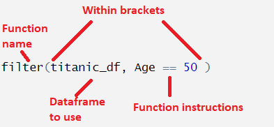
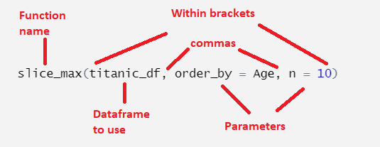

### Learning objectives for this section:

-   Know what a dataframe is and how one looks in this book
-   Know how to run a function on a dataframe
-   How to explore and adjust rows and columns in a dataframe:
    -   select
    -   slice
    -   rename
-   Arrange columns
    -   ascending and descending
    -   multiple columns
-   Write better code using the pipe

## Dataframes

One of the data types that we can work with in R is a **dataframe**. This in a object with rows and columns, like a spreadsheet in Microsoft Excel or Google Sheets.

Almost all structured data comes in this form, and for the rest of the course the datasets we'll work with will all be dataframes. Later, you'll learn how to import dataframes from your computer or online sources. For now, we'll work with a dataframe which has been loaded into the memory of the programming language in this book.

Remember in the previous week we could create variables, such as `x = 5` or `y = 10`? We could also call these objects (in our code's memory x is an *object* with the value 5). A dataframe can also be stored with a name and manipulated as an object.

Usually, you need to load dataframes from external sources, such as a spreadsheet file, or from a file online, or by web scraping, and so forth. In this book environment, there is already a dataframe with the name `titanic_df`. The object `titanic_df` is a spreadsheet-like object containing one row for each passenger on the Titanic. The columns in this object contain information about the passengers, such as their name, age, passenger class and so forth.

```{webr-r}
#| context: setup

library(dplyr)
library(readr)
library(DT)

url <- "https://raw.githubusercontent.com/yann-ryan/infovis-course/master/titanic_df_full.csv"
download.file(url, "titanic_df.csv")

titanic_df =  read_csv('titanic_df.csv')

```

The simplest way to look at a dataframe or any other object is to enter it in a code cell and run the code, just as we did with simper variables like numbers or vectors. Try it by running the code below:

::: callout-tip
Refreshing the page will reset everything and get rid of the output, if you want to start again.
:::

```{webr-r}
titanic_df
```

It's worth familiarising yourself with how a dataframe looks when you print it in the book like this, because it will help to understand the results of your actions. When you work with Posit cloud and RStudio, the interface is specially set up for viewing dataframes, where they will be easier to read, like in spreadsheet software such as Excel.

-   The first line is `# A tibble: 1,309 x 11` describes the dataset. A 'tibble' is just another name for a dataframe. This dataframe has 1,309 rows and 11 columns

-   Next is `survived pclass name     sex      age sibsp parch ticket  fare cabin embarked`. These are the names of each of the columns in the dataset - which are also known as variables.

-   The next row `<dbl>  <dbl> <chr>    <chr>  <dbl> <dbl> <dbl> <chr>  <dbl> <chr> <chr>` contains the 'types' of each of the columns. We'll talk more about that later.

-   The next 10 rows are a preview of the first 10 rows of the dataframe. You can see that the text in each column is often truncated so that most columns can be displayed at once.

-   The final line `# ℹ 1,299 more rows` is pretty self-explanatory: there are a further 1,299 rows not shown.

### The Titanic Dataset

It's good to understand a bit more about the dataset which we'll use quite a lot for examples, exercises and visualisations over the next few weeks. You can find out more about the dataset [here](https://www.openml.org/search?type=data&sort=runs&id=40945&status=active). It contains information on 1,309 passengers who sailed on the titanic, such as their age, sex, and the fare paid. The column names are the following:

-   survived: either 1 or 0, indicating whether the passenger survived or not.

-   pclass: either 1, 2, or 3, listing the passenger class

-   name: the full name of the passenger

-   sex: the sex of the passenger, either male or female

-   age: the age of the passenger, sometimes given with decimals

-   sibsp: the number of siblings or spouses on the same ticket

-   parch: the number of parents or children on the same ticket

-   ticket: the unique ticket number (like an order number)

-   fare: the fare paid (for the entire ticket)

-   cabin: the cabin number

-   embarked: where the passenger got on the ship, either Southampton (S), Cherbourg (C), or Queenstown (Q). Queenstown is in Ireland and is now known as Cobh.

Each individual is a separate row in the dataset, but the ticket numbers are often repeated. This is because one ticket could cover multiple people, for example a family. The fare given is for the ticket as a whole.

::: callout-tip
This Titanic dataset is famously used for many data science lessons and challenges. We will use it extensively the next few weeks because it has some attributes which make it very useful for teaching data analysis. You should also think critically about it: as with all datasets, the information and insights derived from it should be taken with a grain of salt. For an interesting analysis of the problems around using a dataset like this for data science/machine learning, see @machine2018.
:::

## Tidyverse

Most of the work in this course will use a set of packages developed for R called the 'tidyverse'. These enhance and improve a large range of R functions with a more intuitive syntax, particularly for working with dataframes and for visualisation. The Tidyverse is really a 'family' of individual packages for sorting, filtering and plotting data frames. Almost all of the functions we use from now on will come from this family.

## Functions

The way we'll do operations on dataframes is to use *functions* on them. A function is a pre-made piece of code which does a particular task on a piece of data. The task might be an algorithm or mathematical process, and the data might be something as simple as a number, or it could be a dataframe, which we will be mostly working with here. You have already used the `print()` and `nchar()` functions, in the previous week.

When we manipulate dataframes, or create visualisations, we will almost always use one or more of these functions (you can also write your own, but we won't cover that on this course). It's important to understand how to use a function in R for this course.

### Function names

A function in R is stored as a single 'string' (a sequence of characters with no spaces) followed by an open and closed set of brackets. A function called 'function' will look like this in R: `function()`.

Most of the functions we work with will have logical-sounding names, usually verbs. For example, the function to filter a dataset is called `filter()`, and the function to select certain columns is called `select()`.

### Function arguments

Some functions work entirely within themselves and don't need any further information, but usually, we'll need to supply at least a few things to make a function work. The elements that we supply to the function are called 'arguments'. Each argument in a function is placed within the brackets of the function, and each one must be separated by a comma.

Typically, the functions we use will make a change to a dataframe (such as filter or select). For these kinds of functions, we usually need to supply at least two things:

-   The dataframe to be worked on

-   The further instructions on what the function should do specifically to the dataframe.

Sometimes, we will also need to set *parameters* (basically options), which are more specific instructions on how the function should act.

It's good to familiarise yourself with how a function looks and how you can use them. This is a typical example:



Different functions will need different instructions, depending on what they do. The code above runs the filter() function on the dataset `titanic_df`, with the instruction that the data in the `Age` column should equal 50.

Here is another example:



Here, we use the function `slice_max` on the dataframe `titanic_df` (we'll learn what this does later). This time we have to set two parameters. Parameters have specific names and we set their values using an single equal sign. Here, we have to set the `order_by` parameter, which we have set to the column `Age`, and we have to set the `n` parameter, which we set to `10`.

::: callout-warning
Notice in the first function we used `Age == 50`, and in the second function we used `order_by = Age`? This is because they mean different things. In R, a double equal sign (`==`) means 'check if this is equal to'. A single equal sign (`=`) means 'set this to the value of'.

When setting the value of a parameter, we always use a single equal sign. Using the wrong one is an easy mistake to make and can be good to check when troubleshooting!
:::

### Exercises:

Run the `summary()` function on the `titanic_df` dataset. `summary()` prints summary statistics on each column of the dataframe.

```{webr-r}

```

Use summary again, but this time set the argument or parameter `digits` to equal `3`. This optional parameter specifies the number of digits after the decimal point which should be shown.

```{webr-r}

```
