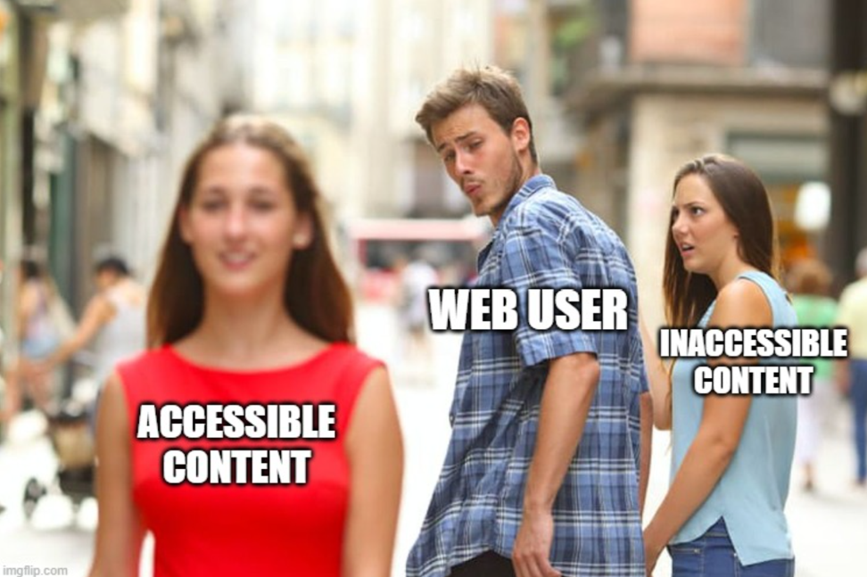

```{webr-r}
#| context:setup

library(tidyverse) 
library(palmerpenguins)  

penguins = palmerpenguins::penguins  

```

{fig-alt="A man walking with his partner turns his head to look at another person, symbolizing a web user’s shift from inaccessible to accessible content. The original partner, representing inaccessible content, is ignored in favor of the accessible option, which is more appealing and inclusive." fig-align="center" width="500"}

### **What does it mean to make our content accessible?**

When making visualizations it is important to take into account accessibility. In this context, **accessibility means making the content more readable and understandable by everyone.**

We should remember that those viewing our content, particularly if it is placed online may have issues with:

-   Sight

-   Colour perception

-   Motor skills

Some key ways in which we make visualisations *less* accessible include:

-   Prioritising the visual experience without consideration for people navigating via screen reader.

-   Color schemes that are not accessible to people who are color blind or have low vision

-   Interactive elements that are not reachable for people navigating via keyboard.

### Color-blindness

Color blindness (or color vision deficiency, CVD) is the decreased ability to see color or differences in color, specifically hue.

The most common is less distinction on red-green (deuteranomaly or protanomaly) or blue-yellow (tritanomaly) axis. Red green affects about 8% of males and 0.05% of females.

In order to understand how colour in data visualisation is perceived by those with CVD, we should think back to the previous week's lesson on the differences between scales. The three key scales, as you'll remember, are **sequential** (for continuous data), **categorical** (for text or categories), and **diverging** (which are sequential, but with a 'midpoint'. These are affected in different ways.

#### Sequential color scales

**Sequential color scales** are affected the least, because they are generally made up of a single hue. However, the default blue color scale provided by ggplot is not terribly good for those with general sight impairments - the 'Viridis' color palette, which we have used last week, is a good alternative choice as it is easier to distinguish differences. Another option is to apply a gradient scale, running from one distinct colour to another.

{width="400"}

To make these changes in our code, we'll need to use the `scale_colour_` functions. For instance, to specify the gradient colors for a scatter plot, use `scale_color_gradient()`.

**Try it yourself:** Edit the plot below to use either the 'Viridis' continuous scale, or a gradient with two colours of your choice.

```{webr-r}

ggplot(data = penguins, aes(x = bill_length_mm, y = flipper_length_mm, color = body_mass_g)) +    
  geom_point(size = 3)  

```

#### Diverging color scale

A special type of gradient is a 'diverging' color palette, where third color is used as a midpoint.

In both these cases, we should be mindful of using problematic color pairs. Red-green diverging, in particular, should be replaced with another color scale.

{width="450"}

**Try it yourself:** How can you make this chart of the US election results in 2020 more accessible?

```{webr-r}
#| warning: false
#| error: false
#| message: false

df = results_2020 = read_csv('https://raw.githubusercontent.com/fivethirtyeight/election-results/refs/heads/main/election_results_presidential.csv') |> 
  filter(cycle == 2020 & stage == 'general' & candidate_name == 'Joe Biden') |>
  select(candidate_name, state_abbrev, percent) |> 
  filter(!is.na(state_abbrev))

states_map = usmapdata::us_map(regions = 'states')

states_map |>
  left_join(df, by = c('abbr' = 'state_abbrev')) |>
  ggplot()  + 
  geom_sf(aes(fill = percent)) + 
  scale_fill_gradient2(low = 'red', mid = 'grey95',  high = 'blue', midpoint = 50) 

```

#### Categorical color scales

Finally, categorical color schemes (where the data is unordered, usually for categories or text), use a palette of distinct colors specifically chosen to be safe for color vision deficiency. You can find a set of built-in palettes on the [ColorBrewer website](https://colorbrewer2.org/). Select 'qualitative' and tick the 'color-blind safe' checkbox. The three remaining palettes are 'Dark2', 'Set2', and 'Paired'.

**Try it yourself:** To choose a specific palette for a categorical value (such as species, in this case), use `scale_color_distiller()` and specify the palette from the list of color blind safe above.

```{webr-r}

ggplot(data = penguins, aes(x = bill_length_mm, y = flipper_length_mm, color = species)) +    
  geom_point(size = 3) 

```

### Contrast

Another important thing to take into account is contrast. Contrast can be defined as the difference in perceived luminance between two colors. Higher contrasts are easier to perceive for everybody, particularly those with sight impairments.

For example, in comparison to a white background (the most commonly-used colour):

Pure red has a ratio of 4:1

Pure green has a ratio of 1.4:1 (very low)

Pure blue has a ratio of 8.6:1 (quite high).

Again, think about this when designing color schemes.

For instance, try not to use colors with a low contrast ratio, particularly against a white background. By default, ggplot2 uses a grey background, but often white is a requirement or desired for design choices.

**Try it yourself:** use scales to pick more suitable colours for the plot below.

```{webr-r}

ggplot(data = penguins, aes(x = bill_length_mm, y = flipper_length_mm, color = species)) +    
  geom_point(size = 3) + 
  theme_bw() 

```

## Making non-data elements accessible

In the previous chapter we learned how to customise 'non-data elements' (titles, fonts, backgrounds, axis tick marks and so forth) using themes. Good use of these can also make data visualisations more accessible.

**Some general considerations for themes:**

-   Make the font as large as is suitable for the image

-   Use a sans serif font

-   Use a black or dark grey text for annotations and labels of lines or segments

-   Use a lighter grey for axes labels so the important information stands out -- see this [colours guidance](https://analysisfunction.civilservice.gov.uk/policy-store/data-visualisation-colours-in-charts/) for more information

-   Only use coloured text when it is essential -- if you are using coloured text [use a contrast checker to make sure your text meets the contrast requirements against the background](https://webaim.org/resources/contrastchecker/)

## Alt-text

A final consideration, particularly when making charts which are to be viewed online, is to take into account readers who use screen-reading software. We should aim to provide **alt-text** for images, which will be read out loud by screen readers. In doing so, you should aim to summarize the visual elements and key points of the chart.

### **Alt Text defined [from Webaim](https://webaim.org/techniques/alttext/):**

> It is read by screen readers in place of images allowing the **content** and **function** of the image to be accessible to those with visual or certain cognitive disabilities.
>
> It is displayed in place of the image in browsers if the image file is not loaded or when the user has chosen not to view images.
>
> It provides a semantic meaning and description to images which can be read by search engines or be used to later determine the content of the image from page context alone.

The following is a good template to use for writing alt-text:

{width="500"}

#### **Chart type**

It's helpful for people with partial sight to know what chart type it is and gives context for understanding the rest of the visual.\
*Example: Line graph*

#### **Type of data**

What data is included in the chart? The x and y axis labels may help you figure this out.\
*Example: number of bananas sold per day in the last year*

#### **Reason for including the chart**

Think about **why** you're including this visual. What does it show that's meaningful. There should be a point to every visual and you should tell people what to look for.\
*Example: the winter months have more banana sales*

#### **Link to data or source**

Don't include this in your alt text, but it should be included somewhere in the surrounding text. People should be able to click on a link to view the source data or dig further into the visual. This provides transparency about your source and lets people explore the data.\
*Example: Data from the [USDA](https://data.ers.usda.gov/reports.aspx?ID=17850)*

### Adding alt-text in R Markdown.

You can add alt-text to static images or to generated plots made in code cells.

To add alt-text to R Markdown files, switch to the Source editor in Posit Cloud/RStudio.

#### Code cell options

We can add what are known as 'cell options', which allow us to edit how the result of a code cell is displayed in the knitted markdown file. In R Markdown, enter your code cell options between the first set of curly brackets, after the r. Leave a space, then each option, an equal sign, and the required value. Leave a comma in between each option.

You can use this to change the figure width and height in the output (`fig.width` and `fig.height`), whether or not the code is displayed in the finished file (`echo=false)`, and many more.

Alt-text can be added to a generated figure from a code cell using the cell option `fig.alt`. The screenshot below shows how it should be added to a code cell:


