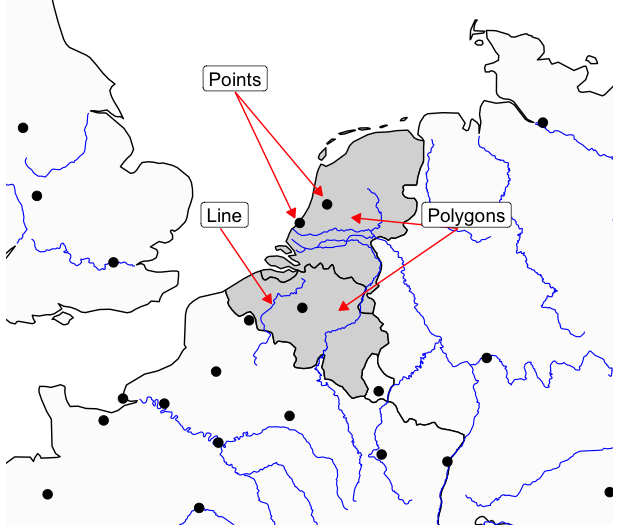

## What is a shapefile?

When we make maps programmatically, we need to create both the data and the underlying geographic map to go with it.

In R this is done using *shapefiles*. Shapefiles are a general name for datasets of geographic features, such as points, lines or polygons. The type of shapefile we'll work with first is one containing outline shapes of geographic entities, or *features*. This could be polygons outlining the shape of the coastline, or it could be detailed internal borders of countries, regions, or municipalities.

{width="600"}

There are many sources of shapefiles available. Many national and international bodies publish official shapefiles of political regions, often at several different levels. For example, the EU publishes hierarchical shapefiles containing different levels of administrative regions, called LAU (Local Adminstrative Units) and NUTS (nomenclature des unités territoriales statistiques). These can be [downloaded](https://ec.europa.eu/eurostat/web/gisco/geodata/statistical-units/territorial-units-statistics) and used to create maps programmatically, for example if you want to make a data map of some statistics related to Dutch municipalities. These files can be read into R.

::: callout-tip
## Historical shapefiles

Boundaries change throughout time, and often a shapefile containing modern boundaries is not relevant. There are also many sources of historical shapefiles such as the [historical GIS of the Low Countries](https://datasets.iisg.amsterdam/dataset.xhtml?persistentId=hdl:10622/PGFYTM) and the [Vision of Britain project](https://www.visionofbritain.org.uk/data/), containing information on historical national or regional boundaries, often at different points in time.
:::

There are thousands of shapefiles available to download and use freely from various databases, ranging from historical to political. This week we will learn how to download and map a shapefile using an R package, which is a very simplified workflow, but also very limited in the range and variety of shapefiles which are available. Next week we will learn how to download and import shapefiles from external resources, and use data to create and map our own.

## The sf package and 'simple features' objects

To build a map, we need to import special data into R. To do this we'll use a package called `sf.` `sf` stands for simple features. It is a data format specially made for geographic data. Essentially, a simple features object looks like the dataframes (the rows and columns) we have been working with all along, except with one new column, called geometry. Each row of the data can be considered a 'feature', meaning a single point, line, or polygon.

So each row contains a single feature. Usually, these will have additional information about them. For example, one 'feature' might be a polygon shape for a single country. This might have a row of information with the country name, ISO code, even population and so forth.

The special 'geometry' column is what makes it geographic information. This contains the geographic information for that feature. In the case of a polygon shape for a country, it will contain a list of the points which, joined together, make up the shape of that polygon. A points feature will contain a single set of geographic coordinates, and a line will contain a list of points, but it won't be joined-up, like a polygon. Each sf object will only contain one type of feature.

::: callout-note
## Coordinate Reference System

As well as this geometry column, each sf object will have a further piece of information attached to it - a CRS or *coordinate reference system*. Often, if you download a map file from the internet, it may already have one of these embedded. If you make your own set of features (a set of points, for example), then you will need to add a CRS yourself. In order to add maps together (for example, to have a baselayer of polygons and a layer of points over that), they'll both need to have the same CRS. We'll talk more about the CRS next week.
:::

The good news about sf objects is that they behave just like dataframes. This means that we can apply all the techniques and code we learned over the past few weeks to these objects. For example, if you have a sf object which is a list of countries and you want to map only a few of them, you could do this with filter(). Or, you can use group_by() and summarise() if you have a group of points and you want to group them all together.

The `sf` package also has many additional features to perform complicated calculations and transformations of geographic data. If you are interested in learning more, I highly recommend reading all or part of [Geocomputation with R](https://r.geocompx.org/). For now, we will stick with simple calculations, based on the kinds of things we have already been learning, just with geographic data.

## R Natural Earth package

This week we will download and map a simple shapefile, of country borders, using an R package. In cases where you need more specific or detailed shapefiles, you'll usually need to download them from an external source and import them into R, which we'll learn over the coming weeks.

To download and map shapefiles, we'll need two new packages: `rnaturalearth` and `sf`. You'll find `sf` on the next page.

### rnaturalearth

In R, the easiest way to find shapefiles is using a package and a database called RNaturalEarth. RNaturalEarth allows you to connect to a database called [Natural Earth](https://www.naturalearthdata.com/), containing many shapefiles, including many different sets of borders, such as state, country, municipality etc. It is also possible to download a shapefile of the coastline without internal borders, which is useful for some kind of data maps.

As well as basic shapes of countries, you can download rivers, lakes, and other physical features, to make more detailed or aeshetically pleasing maps.

### Downloading shapefiles

We'll practise three methods for getting data from Natural Earth: first, a quick-ish way to download the most-used shapefiles, **countries** and **coastlines**, and second, a more general method for downloading any file from the database.

First, load the library:

```{webr-r}
library(rnaturalearth)
```

## Country borders

To download a shapefile of country borders, use the function `ne_countries()`. Remember to save this as an object in your environment using `<-`. As well as the function itself you'll need to specify some further parameters:

-   `scale =` , which will determine how detailed the borders should be, one of `small`, `medium`, or `large`.

-   `returnclass =`, which will specify the type of data to be downloaded from the database. In all cases, we'll use `returnclass = 'sf'` (note the quotation marks around sf). This returns the file in the format we want to work with, **simple features**.

-   Optionally, you can specify that the function return a single country or list of countries. This is done using the syntax `country = 'Netherlands'` or `country = c('Netherlands', 'Spain')`.

The following code will download a dataset in sf format, of all world countries:

```{webr-r}
worldmap = ne_countries(scale = 'medium', returnclass = 'sf')
```

**Try it yourself:** Download a small scale shapefile containing Germany, Netherlands, France, Belgium, and Luxembourg. Don't forget to assign it as an object using `<-`.

```{webr-r}

```

## Downloading coastlines

This code downloads a simple map of the world's coastlines, useful if you want a map without any political borders. This is done with the function `ne_coastline`. In this case, we should specify the `scale` and `returnclass`:

```{webr-r}

worldcoastlines = ne_coastline(scale = 'medium', returnclass = 'sf')

```

## Downloading other data

R Natural Earth has a huge amount of other data you can download. The functions ne_countries() and ne_coastline() are there to give easy access to some of the most common shapefiles. For other data, you can use the more complex ne_download().

This function works similarly, but allows you to download other data. This ranges from physical features like lakes and rivers, to cities, ports, and airports. Note however that the package is reliant on the Natural Earth database remaining the same, so occasionally you will find it does not correctly download a dataset.

In order to work with this function, you need to know how the Natural Earth database stores data. Each file is one of three categories:

-   cultural: meaning 'human-created' geographic objects such as country borders, cities, and so forth.
-   physical: physical features such as rivers, lakes, mountains.
-   raster: geographic data made from pixels instead of shapes. We won't work with this on this course.

Next, the data is at one of three scales: - small - medium - large.

On the Natural Earth data download page, you'll see that there are links to each of these categories at each different scale.

### Find a file on the database website.

To download a specific file, first find it on the [Natural Earth site](https://www.naturalearthdata.com/downloads/). You'll see the data is divided into categories and sizes:


Use the website to choose the data you're interested in. Note the size and category you've chosen, for example **large** and **cultural.**

Clicking on a category button will bring you to a page with download links. Right click and use 'copy link address' and save it somewhere. It will look something like `https://www.naturalearthdata.com/http//www.naturalearthdata.com/download/50m/cultural/ne_50m_populated_places.zip`.

### Construct a query

Now we can construct our query. Within the ne_download() function, specify the correct `scale` from small, medium large. Next choose the `category`, from cultural, physical or raster.

**Finally, specify the `type`. For this, take the saved download link, and take everything after the ne\_ and the scale, (in this case `ne_10m_`, and before the .zip. In this example this is simply `populated_places`.**

Finally, set the `returnclass` argument to `"sf"` as before.

```{webr-r}

populated_places = ne_download(scale = 'medium', type = 'populated_places', category = 'cultural', returnclass = 'sf')

```

**Try it yourself:**

Download a medium-scale set of rivers - browse to the right section [here](https://www.naturalearthdata.com/downloads/) and find the relevant filename.

```{webr-r}

```

Download a large-scale set of Admin 1, states and provinces.

```{webr-r}

```
