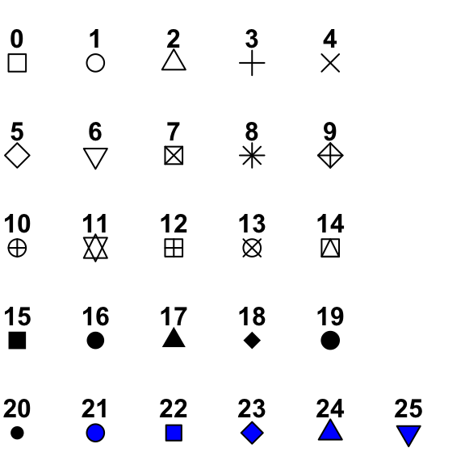
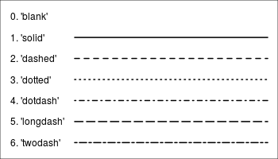

```{webr-r}
#| context: setup
library(readr)


url <- "https://raw.githubusercontent.com/yann-ryan/infovis-course/master/titanic_df_full.csv"
download.file(url, "titanic_df.csv")

titanic_df =  read_csv('titanic_df.csv')


url <- "https://raw.githubusercontent.com/jennybc/gapminder/refs/heads/main/data-raw/04_gap-merged.tsv"
download.file(url, "gapminder_df.csv")

gapminder_df =  read_tsv('gapminder_df.csv') |> filter(continent!= 'FSU')

```

## What other charts can we make?

To demonstrate the basic range of charts we can create, we'll use the Gapminder dataset, containing information about countries including GDP per capita, population size, and life expectancy, over time.

```{webr-r}

gapminder_df

```

### Controlling aesthetics

To draw other chart types, we replace the geometry `geom_col` with others. In some cases, we will also change or add aesthetics.

Each chart type is followed by examples of the typical aesthetics which can be used with that geometry.

### Where should this code be placed?

As we learned in the previous section, we can place an aesthetic either within `aes()` or outside it:

-   When we specify an aesthetic *within* `aes()`, we ask for variables from our dataset to be mapped to it. It is best to include the aes() within the `ggplot()` function, though it can also be placed within the `geom_` function.

-   When we specify an aesthetic not within an `aes()`, it is used to map to specific values, such as setting all the points in a chart to blue. When using aesthetics like this, they should always be placed within the `geom_` function.

For each aesthetic, there is an example where the aesthetic is placed within the `aes()` and outside it, to show the difference.

### Geom_point()

`geom_point()` places points on a 2D plane. It requires at least `x` and `y` coordinates within the `aes()`. The result is often called a 'scatterplot' or sometimes a 'bubble chart'.

```{webr-r}

gapminder_df |>
  filter(year == 2007) |>
ggplot(aes(x = lifeExp, y = gdpPercap)) + 
  geom_point()

```

#### Size

We can optionally set the `size` variable.

Outside the aes()

```{webr-r}

gapminder_df |>
  filter(year == 2007) |>
ggplot(aes(x = lifeExp, y = gdpPercap)) + 
  geom_point(size = 5)

```

**Try it yourself:** copy and paste the chart below, and set the size variable to 10.

Inside the aes()

```{webr-r}

gapminder_df |>
  filter(year == 2007) |>
ggplot(aes(x = lifeExp, y = gdpPercap, size = pop)) + 
  geom_point()

```

**Try it yourself:** make a new version of the plot, for the year 2002. Set the population to the x axis, the life expectancy to the y axis, and the GDP to the size variable.

```{webr-r}

```

#### Colour

and/or the `colour` variable:

```{webr-r}

gapminder_df |>
  filter(year == 2007) |>
ggplot(aes(x = lifeExp, y = gdpPercap, size = pop)) + 
  geom_point(color = 'red')


```

```{webr-r}

gapminder_df |>
  filter(year == 2007) |>
ggplot(aes(x = lifeExp, y = gdpPercap, size = pop,color = continent)) + 
  geom_point()


```

**Try it yourself:** create a plot with the points all the same colour: `forestgreen`. You need to choose where the aesthetic should go, out of the two examples above!

```{webr-r}

```

#### Alpha

Alpha sets the transparency, a number between 0 and 1:

```{webr-r}
gapminder_df |>
  filter(year == 2007) |>
ggplot(aes(x = lifeExp, y = gdpPercap, size = pop,color = continent)) + 
  geom_point(alpha = .5)
```

#### Shape

Or the shape. There is a set of numeric codes to select specific shapes. Here is the full set:

{width="300"}

```{webr-r}
gapminder_df |>
  filter(year == 2007) |>
ggplot(aes(x = lifeExp, y = gdpPercap, size = pop)) + 
  geom_point(shape = 2)
```

```{webr-r}
gapminder_df |>
  filter(year == 2002) |>
ggplot(aes(x = lifeExp, y = gdpPercap, size = pop,shape = continent)) + 
  geom_point()
```

::: callout:hint
## More on shapes

Notice that shapes 21 through 25 are blue with a black outline? Using these allows you to set the outline and the fill of a shape separately. If you set the shape to one of these, you can now use `colour =` to set the outline and `fill =` to set the inside colour, resulting in a 'bubble chart'.

```{webr-r}

gapminder_df |>
  filter(year == 2002) |>
ggplot(aes(x = lifeExp, y = gdpPercap, size = pop, fill = continent), color = 'black') + 
  geom_point(shape = 21)

```
:::

### Use

Scatterplots are often used to show relationships between variables, like the obvious link between GDP and life expectancy shown here.

### Geom_line

geom_line will draw a line between points in numerical order.

```{webr-r}
gapminder_df |> 
  filter(country == 'Netherlands') |>
  ggplot(aes(x = year, y = lifeExp)) + 
  geom_line()
```

**Try it yourself:**

Draw a similar plot, for a country in the dataset of your choice.

```{webr-r}

```

#### Colour

You can set line color:

::: callout-tip
You can choose from a huge number of colours in your charts. A lot of colours have specific names, which are all listed [here](https://r-charts.com/colors/). Alternatively, you can choose colours using HEX codes: put \# before the code and add it as normal.
:::

```{webr-r}
gapminder_df |> 
  filter(country == 'Netherlands') |>
  ggplot(aes(x = year, y = gdpPercap)) + 
  geom_line(color = 'forestgreen')
```

```{webr-r}
gapminder_df |> 
  filter(country %in% c('Netherlands', 'France', 'Germany', 'Spain', 'United Kingdom')) |>
  ggplot(aes(x = year, y = gdpPercap, color = country)) + 
  geom_line()
```

::: callout-note
To set the colours for these countries individually we can use a custom colour scale, which we'll cover next week.
:::

**Try it yourself:** choose another five countries from the data. Chart the change in population per year, with each country having a different colour.

#### Linetype

Linetype can be set using a set of codes. Here are the main ones:



```{webr-r}
gapminder_df |> 
  filter(country == 'Netherlands') |>
  ggplot(aes(x = year, y = gdpPercap)) + 
  geom_line(linetype = 'dashed')
```

```{webr-r}
gapminder_df |> 
  filter(country %in% c('Netherlands', 'France', 'Germany', 'Spain', 'United Kingdom')) |>
  ggplot(aes(x = year, y = gdpPercap, linetype = country)) + 
  geom_line()
```

### Use

Line graphs are usually used to show something changing over time. Because a line is drawn connecting each data point to the next one, we assume that one follows another in a logical sequence.

### Multiple geoms

You can stack multiple geoms on top of each other, just add them using another `+`:

```{webr-r}
gapminder_df |> 
  filter(country == 'Netherlands') |>
  ggplot(aes(x = year, y = lifeExp)) + 
  geom_line() + 
  geom_point()
```

**Try it yourself:**

Draw a chart combining a bar and a line plot, using the data fields of your choice.

### geom_area()

## Statistical chart types

#### geom_histogram

A histogram is a chart which plots the *distribution* of a set of values as a series of bars. Each bar represents a 'bin' or range of values, with the height of the bar indicating how many of the values are within that bin.

We could use it to plot the distribution of the GDP per capita in 2007, for example:

```{webr-r}

gapminder_df |> 
  filter(year == 2007) |>
  ggplot(aes(x = gdpPercap)) + geom_histogram()

```

The code for a histogram looks a little different than usual. We only set the `x` variable - the y position will be automatically calculated when it does the statistical transformation.

Second, you'll notice a message: `stat_bin()` using `bins = 30`. Pick better value with `binwidth` underneath the plot. Ggplot automatically divides the data into 30 equal-sized bins by default, but this is often not the clearest way to represent the distribution. We can choose either another number of bins with the argument `bins =`, or choose how big each range should be with the code `binwidth =`.

```{webr-r}

gapminder_df |> 
  filter(year == 2007) |>
  ggplot(aes(x = gdpPercap)) + 
  geom_histogram(binwidth = 3000)

```

### geom_density

Another way to show distributions of values is using geom_density:

```{webr-r}
gapminder_df |> 
  filter(year == 2007) |>
  ggplot(aes(x = gdpPercap)) + 
  geom_density( )
```

### geom_boxplot

geom_boxplot shows distributions:

```{webr-r}
gapminder_df |> 
  filter(year == 2007) |> 
  filter(!is.na(pop)) |>
  ggplot(aes(x = continent, y = lifeExp, group = continent)) + 
  geom_boxplot()
```

A boxplot visualises the distribution of numbers (in this case, the life expectancies of countries by continent). The middle line is the average (the mean). The upper and lower ends of the box are the 25th and 75 percentiles, and the dots (if any), show outliers.

This particular plot shows that in 2007, Europe had the highest average, and not many countries much lower or higher than the average (the distribution), whereas Africa had a much lower average, with a higher distribution.

geom_boxplot has many attributes which can be changed, determining how the statistics are visualised. You can see these by typing `?geom_boxplot` in the console.

### Special case: geom_text

Geom_text will actually add the text from a column to a visualisation. This is useful if we want to label the chart itself with some values (we'll learn better ways to annotate later in the course).

geom_text() works like any other geometry, except we must supply it with a `label` aesthetic:

```{webr-r}

gapminder_df |> filter(year == 2007) |>
  filter(country %in% c('Netherlands', 'France', 'Germany', 'Spain', 'United Kingdom')) |>
  ggplot(aes(x = country, y = gdpPercap)) + 
  geom_col() +
  geom_text(aes(y =gdpPercap  + 2000, label = round(gdpPercap)))

```

Why have I used `+ 2000` and `round()` here?

### Shapes: geom_polygon, geom_segment, geom_rect

As well as these geoms which create recognisable chart types, it's also useful to know that you can essentially create almost anything by using ggplot to draw shapes either with data or with absolute values. For example, you can make a 'lollipop chart' with a combination of `geom_segment` and `geom_point`, such as here to show the change in GDP from 2002 to 2007:

```{webr-r}
gapminder_df |> 
  filter(year %in% c(2002, 2007)) |>
  filter(country %in% c('Netherlands', 'France', "Germany", "Italy", "Belgium")) |>
  count(year, country, wt = gdpPercap) |> 
  pivot_wider(names_from = year, values_from = n)  |>
  ggplot(aes(x = country, xend = country, y = `2002`, yend = `2007`)) + 
  geom_segment() +
  geom_point(size=3) +
  geom_point(aes(y = `2007`), size=3)+
  coord_flip()
```

Note that geom_segment needs `xend` and `yend`, as well as `x` and `y`. These shapes often have different required aesthetics.

### Add-ons

Another way to get the chart type you want is to install additional packages which use the same 'grammar of graphics' to extend ggplot. You can make animated plots using `gganimate`, networks using `ggraph`. Later in the course we will create maps with a geom called `geom_sf`. There are hundreds of these add-ons, which you can browse [here](https://exts.ggplot2.tidyverse.org/gallery/).
