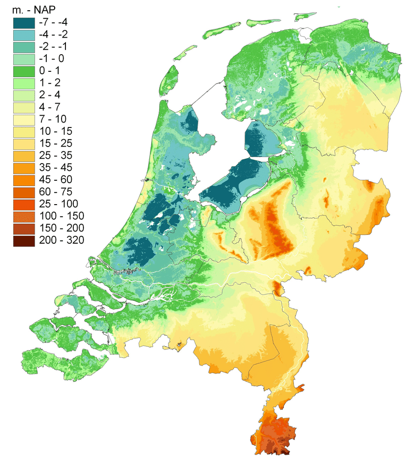
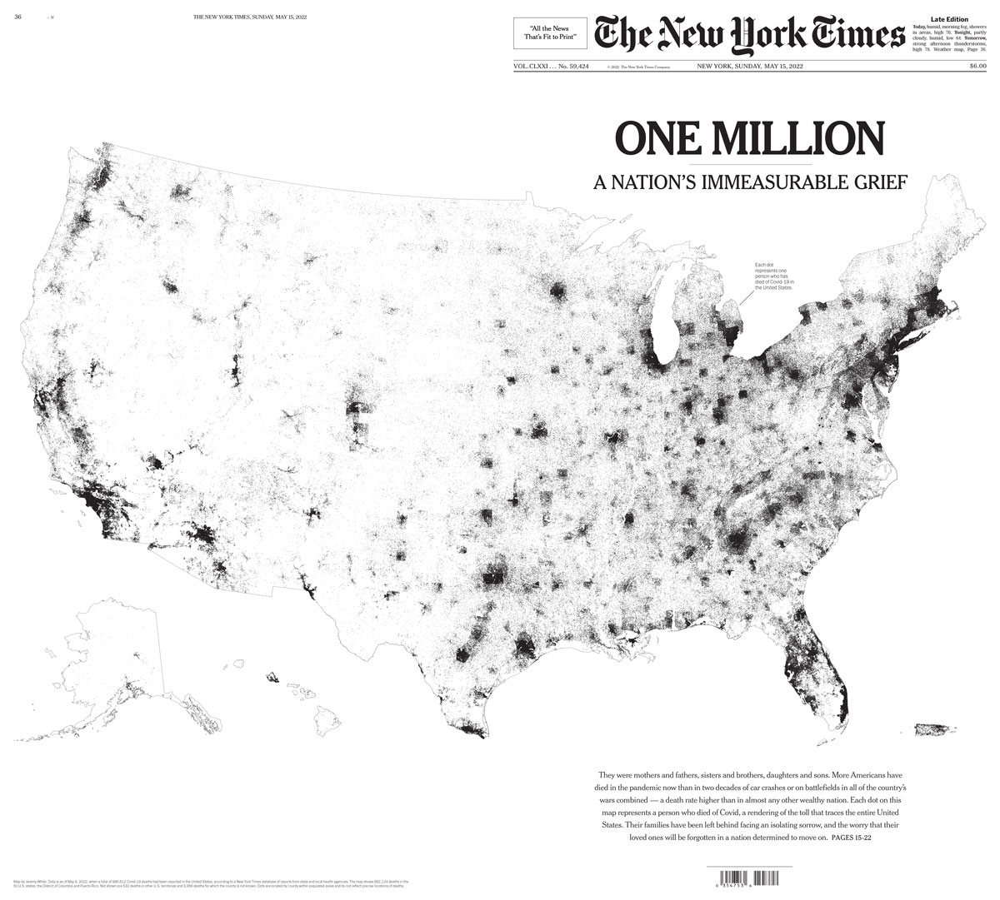
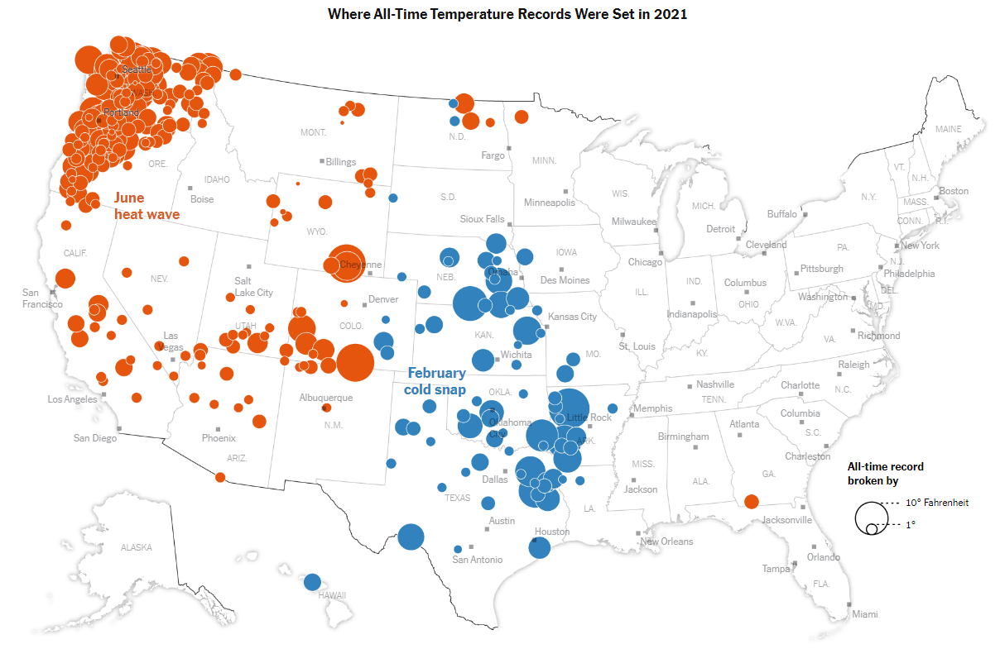
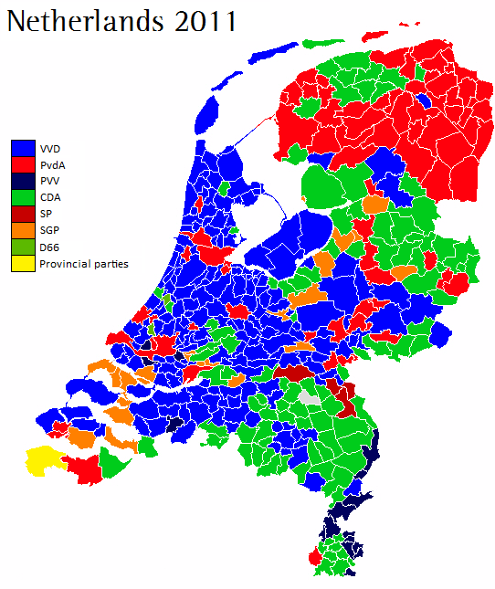
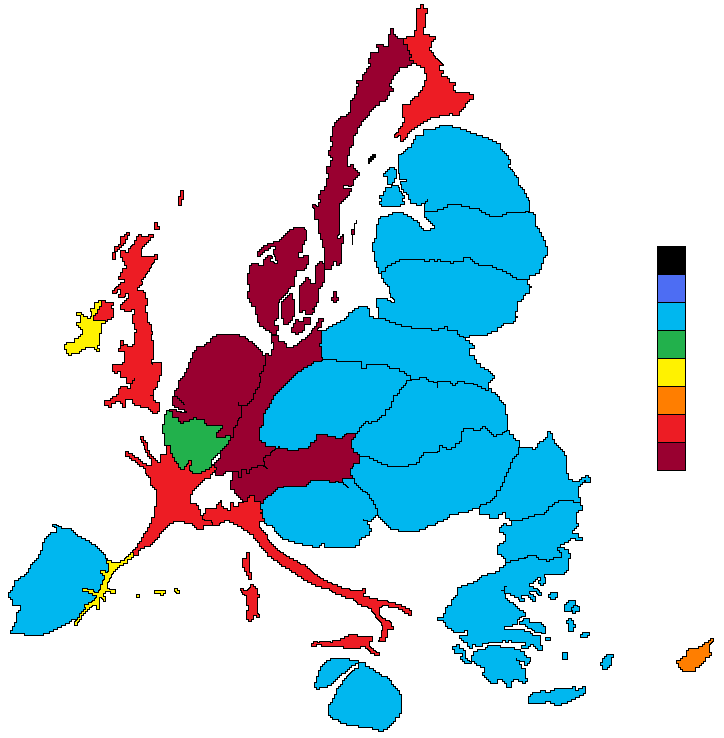

### What exactly is digital mapping?

[{fig-align="center"}](https://xkcd.com/1472/)

In this part of the course, we'll learn how to create data maps. By data maps, we mean maps in which geographic elements, such as points, lines, and polygons, which are mapped to external data, for instance cultural or political data. These kinds of maps have become very familiar and widely used in digital history, data journalism and infographics in recent years.

Maps are useful because some data or information has inherently spatial aspects - *where* the data is from is as important as *what.* We might want to understand geographic patterns of a phenomenon, for instance how language is used in different regions, or the demographic and economic patterns of particular places, and so forth.

On benefit of a map is that they can be useful cognitive shortcuts. Because we all have models of maps in our head already (think about how you know certain pieces of information about the borders of the provinces or positions of towns in your home country), we can often grasp very quickly lots of information. If you know the rough positions of the towns and provinces of the Netherlands, for instance, you will probably be able to understand some data about them more quickly than if the same information was presented to you in the form of a list or table.

Data maps also help us to see patterns which are specifically geographic in nature - we might see, for example, that a certain data point is more common on coasts, or in particular regions, or notice differences between the centre and periphery.

## Creating digital maps

Digital mapping has its own set of techniques, as there are different methods by which we can represent geographic and physical features of the 'real' world as computer code.

### Types of maps

The two most common formats for doing this are called **raster maps** and **vector maps**. On this course we will work exclusively with vector maps but it is useful to know the difference between the two.

{fig-align="center" width="500"}

#### Raster maps

A raster map is made from a grid of pixels. Each individual pixel represents a value relating to the map, such as elevation, weather, or elements such as terrain or roads . This is commonly used when we digitise a physical map - each pixel on a map will be shaded and coloured differently, and this shade will mean something. A digital image of a satellite photograph is a type of raster map. However, the shades of the pixels in a raster map can be mapped to other data. Another example of a raster map is an elevation map. Each pixel is colored by the elevation of that point:

{fig-align="center" width="360"}

A raster map can be worked on computationally, but the techniques are a little different and cover different use cases. For example, it is easier to calculate the length of a feature like a road or river with a vector map.

#### Vector maps

The other kind of map is called a vector map. A vector map represents geographic elements as a series of numerical values. These geographic elements are generally points, lines, or polygons. For instance, a point is represented by a set of two coordinates, giving the latitude and longitude on earth. A line would be represented by a series of numbers, which when joined together make up a line on a map.

{fig-align="center" width="472"}

One difference between the two is that vector maps contain shapes which can be specifically read by computer code. Unlike a raster map, with vector data, we can easily outline the shape of a river or road, or the outline of a province or other political border. This makes vector data particularly useful for creating data visualisations.

## Mapping also involves mapping aesthetics to values

As with all data visualisation, the process involves mapping aesthetics to values. The key difference between maps and other data visualisations is that position is usually based on geographic position, i.e. a real physical location on earth. The most common kinds of data maps you'll find will use **position**, **size**, **color**, and **shape** to draw **points** on a map, or will use position and color (and perhaps patterns) to fill in **polygons**.

Which is used is usually dependent on the specific kind of geographic data you have. Points 'point' to specific, precise places on a map, for instance a town, village, or even an exact address. Polygons are widely used when the data we have relates to political or cultural regions and borders.

### Points Map

This first graphic is an example of simply using position to create a data visualisation. Each covid death has been drawn as a single tiny black point, and through the placement of millions of these points, we can see precisely where the death toll from Covid was highest.

{fig-align="center" width="555"}

::: callout-note
This map of covid deaths demonstrates one weakness of mapping data: often, a map simply duplicates population distribution rather than revealing any useful patterns.
:::

{fig-align="center"}

Just like the earlier data visualisations we made on this course, we can also map further aesthetics as well as position to the data. In this next example from the New York Times, data on weather records was mapped. The authors drew points using both colour (a categorical colour scale, either red for heat or blue for cold records) and size (the amount by which the previous record was broken) to communicate the areas where temperature records had been most extreme in that year.

{fig-align="center" width="500"}

### Choropleth maps

A classic use of mapping data to polygons are election maps. This is because election results are usually counted by region, municipality, or other political border. In this example from the 2011 election in the Netherlands, each municipality is represented by a polygon. Each polygon is then coloured by the winning party. A discrete colour scale is used, because this is categorical data (each region has exactly one winning party).

{fig-align="center" width="420"}

A map where colour is used to present statistical data through polygon shapes is known as a **choropleth** **map**. These maps tend to be useful when we have data which is not related to a single point (such as a town or city), but is connected to regions, such as countries, municipalities and so forth.

However, there are some issues we should be aware of making choropleth maps. In the example of the election map above, about half of the map is coloured blue. This might lead us to think that the VVD party received over half of the total votes. But while they were the largest party, in fact they won 112 seats out of a total of 566 - about one-fifth of the votes.

This is of course because this map hides the fact that elections are related to population rather than land area. The VVD party are bigger in rural areas which tend to be sparsely populated. Generally, when creating data visualizations, it is best practice that each pixel or piece of 'ink' on the page represents the same amount of numerical value. This is not the case if we use geographic data like this. In this case, the numerical unit is a vote, and some votes are represented by less area than others, because of population density.

::: callout-note
One fix for this is to create a cartogram map. This attempts to distort a map so that the area better reflects the data. This example distorts the shapes of the countries of the European Union so that the area of each is related to the amount of the budget they either contribute or receive (between 2007 and 2013, and per capita).

{width="490"}
:::

Over the next few weeks, we'll learn how to make maps from scratch using R. Starting with mapping some simple data, and moving on to importing our own separate data sources.

This week we'll learn how to make simple data maps from a single source. Next week, we'll import our own geographic and statistical data, merge it together, and map it. We'll learn how to do basic spatial operations using Tidyverse commands. Finally we'll learn how to make points maps using a user interface, QGIS.
