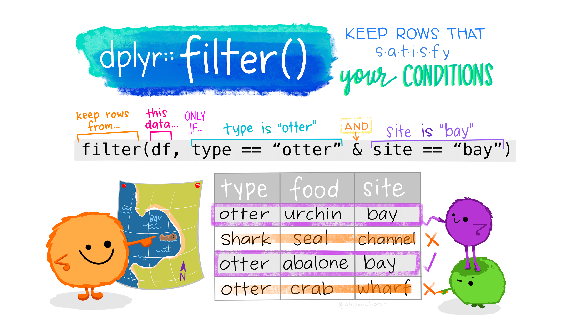

```{webr-r}
#| context: setup

library(dplyr)
library(readr)


url <- "https://raw.githubusercontent.com/yann-ryan/infovis-course/master/titanic_df_full.csv"
download.file(url, "titanic_df.csv")

titanic_df =  read_csv('titanic_df.csv')

```

### Filtering data with filter()

One of the most useful things you will do in data analysis is to filter to only look at certain parts of your data. This is done with a verb called filter(). Filter is very powerful because you can set it to filter for any number of conditions or patterns.

{fig-alt="Cartoon of cute fuzzy monsters dressed up as different X-men characters, working together to add a new column to an existing data frame. Stylized title text reads \"dplyr::mutate - add columns, keep existing.\"" width="600"}

The `filter()` function keeps only certain rows in a dataframe, based on a condition which you set within the function. This is very useful when working with data visualisations, because often you will want to focus on a small amount of the data, or perhaps a single category.

In the `filter` function, the first argument is the data to be filtered. The second is the column you want to look at, and finally, a condition (or multiple conditions). The function will return every row where that condition is true.

Remember in the first week when we looked at comparisons, such as `==`, `<`,`>` and `%in%`? One important way these are used are to set the conditions for a filter.

With filter, need the dataset followed by the column you want to look at, followed by the comparison. The left side of the comparison will generally be a column from your dataframe, followed by a comparison symbol, followed by a value. You can use multiple comparisons using `&`.

::: callout-note
This time, we'll use the pipe (`|>`) from the beginning to make the code easier to follow.
:::

We can use filter to return rows where the text in a column matches a given string:

```{webr-r}
titanic_df |>
  filter(sex == 'female') 
```

**Try it yourself:** in the code cell below, write code to filter the `titanic_df` dataset to contain only rows where the `Embarked` column is equal to the character `Q`.

```{webr-r}

```

Or do the same with a numeric column:

```{webr-r}
titanic_df |>
  filter(age == 50)
```

**Try it yourself:** With numeric columns, we can also use greater than or less than. Write code to filter the `Fare` column to be greater than 5.

```{webr-r}

```

#### Multiple filter conditions

To add two filter conditions, we can separate them with an `&` sign:

```{webr-r}
titanic_df |> 
  filter(age > 50 & sex == 'female') 
```

**Try it yourself:** below, write code to filter the dataset to include only passengers from first class who are also over 70.

```{webr-r}

```

We can also use `|` to make an OR condition. The following will filter to return rows where either the passenger is in first class or they paid over 50 pounds:

```{webr-r}

titanic_df |> 
  filter(fare > 50 | pclass == 1) 

```

#### Filtering a range using %in%

Last week we used the %in% operator to check if any of the elements in one vector were present in another vector. This is very useful when filtering data, because it allows us to filter to a range or list of values.

For example, this will filter the data to return rows where the age is between 20 and 30:

```{webr-r}

titanic_df |>
  filter(age %in% c(20, 21, 22, 23, 24, 25, 26, 27, 28, 29, 30))
```

See that we have created a vector containing the numbers we want to include in the filter condition, and then used the `%in%` operator?

There are quicker ways to create number vectors like this. In R, the code `20:30` will create a numeric vector containing all the numbers between and including the values 20 and 30. You don't even need to use `c()` in this case. So, another way to do the above is to write:

```{webr-r}

titanic_df |>
  filter(age %in% 20:30)
```

We can do the same with strings: just pass a vector of strings as a filter condition, using `%in%`. To return all the passengers which embarked in the locations C or Q, we could do:

```{webr-r}

titanic_df |> 
  filter(embarked %in% c('C', 'Q'))

```

### A negative filter with `!`.

To negate a filter, that is, to return everything which *doesn't* match a given condition, put the `!` before it. For example, to return any row where the `embarked` column does not equal C or Q, use:

```{webr-r}

titanic_df |> 
  filter(!embarked %in% c('C', 'Q'))

```
