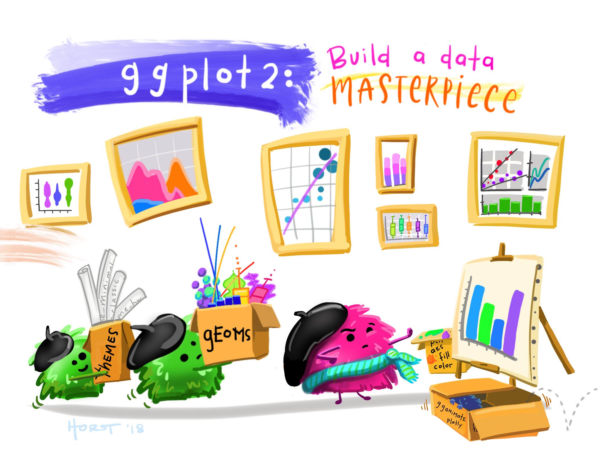

So, that's the basic theory behind how data visualisations work - we simply map aspects of our data to chosen aesthetics, which must at least include positions - generally at least x and y dimensions.

## The ggplot2 package

R has a very widely-used plotting library called `ggplot2`, and this is what we will use to pass our data to various geometries and aesthetics to make plots. ggplot2 is very customiseable - it will let you create almost anything as long as you can feed it data and tell it what it should draw with it.

```{webr-r}
#| context: setup
library(readr)


url <- "https://raw.githubusercontent.com/yann-ryan/infovis-course/master/titanic_df_full.csv"
download.file(url, "titanic_df.csv")

titanic_df =  read_csv('titanic_df.csv')

```

The basis of all `ggplot2` visualisations is a function called `ggplot()`. Think of this as the foundation of your visualisation. You'll tell the `ggplot()` function what data it should use and which attributes of that data it should map to specific aesthetics.

### The *Grammar of Graphics*

This uses a philosophy of visualisation called the 'grammar of graphics' (hence the 'gg' in the name). Essentially, this encompasses a set of rules by which we can construct visualisations, using a standard set of terms and features. Every type of of visualisation in ggplot uses this same set of grammar rules, making it very easy to make many different chart types with very little extra code.

It's best to think of this grammar of graphics in terms of layers. We start with the function `ggplot`, and then supply a dataset and map this data to **aesthetics** : you tell ggplot how to map your numeric data to different visual features like shapes, size, and colours. The next layer is one or more **geometries**: these are the basic visual shapes like bars, points, and lines which make up data visualisations. Optionally you can supply scales, and other elements like facets.

[{width="500"}](https://github.com/allisonhorst/stats-illustrations?tab=readme-ov-file)

## Demonstration - making a bar chart

It's easier to demonstrate how it works. Before you use the package, you'll need to load it, along with the other packages we use to wrangle the data:

```{webr-r}
library(dplyr)
library(ggplot2)

```

As an example, let's draw a simple bar chart using ggplot2. We want to make a simple bar chart from the Titanic dataset we have been using. The workflow looks like this: first we clean and filter the data (if necessary), then we summarise it along the lines which we want, and finally visualise it using ggplot.

### Summarising the data

The first step is to produce the summary of the data we would like to visualise. Let's try something very simple: the total number of male and female passengers. We'll use `group_by()` and `summarise()`, as in the previous lesson:

```{webr-r}

df <- titanic_df |>
  group_by(sex) |>
  summarise(n = n())
  
df
  
```

Now we have a dataset with two columns: `sex`, listing either male or female, and `n`, containing a count of the total number of each of those passengers. We save this as a new object called `df`, though if you want you can simply use the 'pipe' and pass it along to ggplot.

### Making a plot

We can make a plot by building up at least four layers:

#### 1. ggplot()

First, create a new ggplot object with the code `ggplot()`.

#### 2. Data

Next, give it our new summary dataframe to work with, using the argument `data = df`.

::: callout-tip
You can also use the pipe operator and pass your summarised data to ggplot, without saving it as a new object. In that case, you don't need to use the `data =` argument. It's up to you what to do in your own code - I prefer to create a new object if I am using it repeatedly, as here. A good principle in coding is that if you find yourself copying and pasting the same piece of code, there's probably a better way of doing it!
:::

#### 3. Aesthetics

Next we tell ggplot which columns it should use, and which aesthetics it should map these colums to. This is also done by passing the names as parameters to `x` and `y`. First, type a comma after the `data = df` code. Then, insert the code `aes()`. **This tells ggplot it should interpret anything within these parentheses as aesthetic mappings.** Finally, *within* the `aes()`, we'll add the columns and aesthetics: `x = sex, y = n`.

The code for this looks like the following:

```{webr-r}
ggplot(data = df, aes(x = sex, y = n)) 
  
```

#### 4. Geometry

At this point, we have an empty visualisation which specifies the aesthetics which should be mapped. In order to draw the correct geom, or visualisation shape, we need to add it as a layer on top of the ggplot() function.

In ggplot, a bar chart is created using the geom `geom_col()`. `geom_col()`, like all geoms, has a set of aesthetics which must be specified. In this case, we must at least specific the `x` and `y` aesthetics. These correspond to the horizontal and vertical position of the bars. When we give these aesthetics to geom_col, it will automatically figure out what to do with them.

To do this, we add a plus sign (`+`) followed by the geometry `geom_col()`, resulting in a simple bar chart:

```{webr-r}
ggplot(data = df, aes(x = sex, y = n)) + 
  geom_col()

```

::: callout-tip
Adding each layer (anything after a + sign) on a new line makes the code easier to read, though it's not strictly necessary.
:::

**We'll learn about the rest of the layers next week.**

### Adding other aesthetics to the chart

Each chart type will allow you to manipulate different aesthetics, depending on what makes sense for that particular shape. If you are working in Posit/RStudio, you can check all of the options for a function by typing `?` before it, e.g. `?geom_col`, in to the console (the bottom left pane).

For `geom_col`, we *have to* set `x` and `y` and we can *optionally* set `alpha` (the transparency), `colour` (the color of the outline of the bars), `fill` (the color of the inside of the bars), and `linetype` and `linewidth` (allowing you to customise the look of the outline further.

#### Within aes() or outside aes()?

These attributes do different things depending on whether you put them *inside* the `aes()` function or outside. When *outside* the aes() function, they allow you to set an attribute to an absolute value. For example, to set the fill of the bars in our previous example to the colour red, you can do the following:

```{webr-r}
ggplot(data = df, aes(x = sex, y = n)) + 
  geom_col(fill = 'red')
```

**Try it yourself:** Set the outline of this bar chart to black (first copy and paste the existing code), and the linewidth to 2:

```{webr-r}

```

If you set an attribute *within* the aes(), you will *set that aesthetic to a value from your dataframe.*

To demonstrate this, we need to make a new summary of the titanic dataset. Let's make a new dataframe, which will now count the number of passengers who embarked at each location, for each sex, and call it `df2`.

```{webr-r}
df2 = titanic_df |>
  group_by(sex, embarked) |>
  summarise(n = n())

df2

```

Now we have three columns in the summary dataset instead of two: `sex`, `embarked`, and `n`.

If we make the same chart as before with the `df2` dataset, except now set the `fill` attribute to the `embarked` column, *within* the aes(), it will assign fill colours to each category:

```{webr-r}

ggplot(data = df2, aes(x = sex, y = n, fill = embarked)) + 
  geom_col()

```

### Try it yourself:

Recreate the chart above, and set the `linetype` aesthetic to the `embarked` category:

```{webr-r}


```

### Categorical vs continuous variables

Let's calculate another summary of the dataset.

```{webr-r}

df3 <- titanic_df |>
  group_by(embarked) |>
  summarise(avg_paid = mean(fare, na.rm = TRUE), n = n())

```

In the last example, we provided a column containing a string (either a Q, a C, or an S) to the `fill` aesthetic. ggplot interprets these as *categorical variables*, and automatically assigns colours to them, with the aim of making them as distinctive as possible.

If we pass a numerical column, this will be interpreted as a *continuous variable*. Now, ggplot will automatically map a colour scale, running from the darkest (lower number) to the highest (highest number), with a smooth gradient in between. As in this example:

```{webr-r}

ggplot(data = df3, aes(x = embarked, y =n, fill = avg_paid)) + 
  geom_col()

```

We learn a bit more about scales next week. Turn to the next page to find out about more chart types and their most common attributes.
