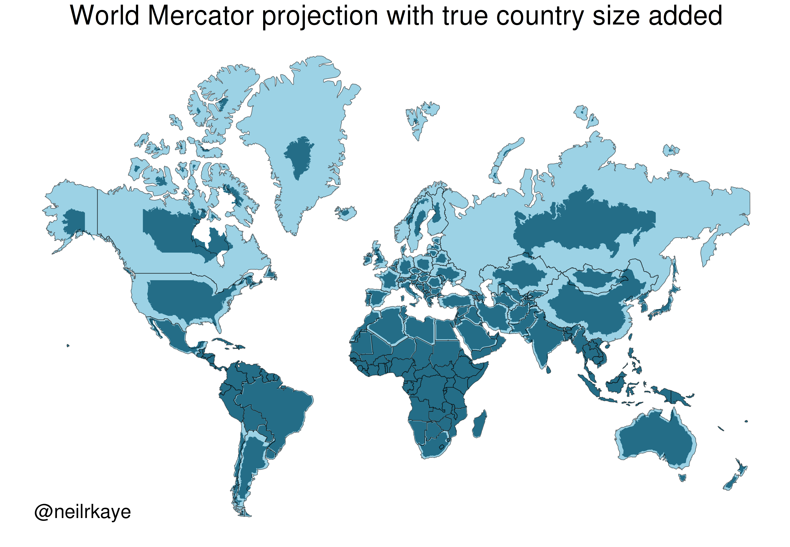

# Creating maps in R

```{webr-r}
#| context: setup

library(sf)
library(tidyverse)
library(rnaturalearth)

worldmap = ne_countries(scale = 'medium', returnclass = 'sf')


```

When we want to create maps with computers, using a Geographic Information System, or GIS, the computer needs to know what to map. Essentially, it needs some data which tell it how to draw shapes. This is usually in the form of a list of coordinates, which make up a polygon. Each individual polygon (or set of polygons, to show separate islands and so forth) might represent a country, region, or municipality, such as this one of these of the country borders of Spain and the Netherlands:

```{webr-r}


worldmap %>% 
  filter(name %in% c('Netherlands', 'Spain')) %>% 
  ggplot() + geom_sf() +
  coord_sf(xlim = c(-10, 7.5), ylim = c(36, 54)) +
  theme_void()

```

Because this is vector data, we can read it into R and make changes to it, for example adjusting the 'fill' color, and changing the color and thickness of the border lines.

### Coordinate Reference System (CRS)

These polygons are not just regular shapes, because they contain geographic information, which consists of information relating to position on the earth's surface. In the previous example, we need to know how the two shapes relate to each other on the earth, and if we wanted to add more data, we would need to be sure it was using the same system.

This position is usually expressed as latitude and longitude coordinates. A set of latitude/longitude coordinates relate to a single position. For example, the coordinates 52.160114, 4.497010 refer to a point which is 52.160114 degrees North of the Equator, and 4.49 degrees East of the prime meridian (Greenwich in London).

There is one further complication with maps. Because they are not a flat surface but a sphere, and, furthermore, that sphere is not perfect but has a slightly different set of distortions depending on where you are in the world.

To account for this, any geographic object also needs a coordinate reference system or CRS. This tells the map maker or map-making software how to interpret the coordinates on a sphere. It can also include information on the projection to be used. We won't need to worry too much about the specifics of this when creating our own maps, except to know that if we want to combine multiple geographic sources, they must use the same CRS.

### Projections

A second complication arises when we try to turn a 3D object (the earth) into a flat, two-dimensional one (a map). In order to do this, mapmakers have to decide how to do it, using a technique called a projection, which projects a 3D object onto a 2D plane.

There are lots of ways of doing this, and they can be controversial. Essentially, when making projections, mapmakers have to balance accurate shapes with accurate areas.

The most famous and widely-used projection is Mercator. This preserves the shape of the world quite well, but it distorts the areas quite a bit, depending on how far or close they are to the equator. Consequently, this projection makes countries in the global south much smaller than they are in reality. This is a good example of how the decisions on how maps are made, and who made them (in this case, western Europeans), can have a huge effect on the perception on places.



## Working with maps: the sf package

To build a map, we need to import special data into R. To do this we'll use a package called sf. sf stands for simple features. It is a data format specially made for geographic data. Essentially, a simple features object looks like the dataframes (the rows and columns) we have been working with all along, except with one new column, called geometry. Each row of the data can be considered a 'feature', meaning a single point, line, or polygon.

So each row contains a single feature. Usually, these will have additional information about them. For example, one 'feature' might be a polygon shape for a single country. This might have a row of information with the country name, ISO code, even population and so forth.

The special 'geometry' column is what makes it geographic information. This contains the geographic information for that feature. In the case of a polygon shape for a country, it will contain a list of the points which, joined together, make up the shape of that polygon. A points feature will contain a single set of geographic coordinates, and a line will contain a list of points, but it won't be joined-up, like a polygon. Each sf object will only contain one type of feature.

As well as this geometry column, each sf object will have a further piece of information attached to it - a CRS or coordinate reference system. Often, if you download a map file from the internet, it may already have one of these embedded. If you make your own set of features (a set of points, for example), then you will need to add a CRS yourself. In order to add maps together (for example, to have a baselayer of polygons and a layer of points over that), they'll both need to have the same CRS. We'll learn how to add this later.

The good news about sf objects is that they behave just like dataframes. This means that we can apply all the techniques and code we learned over the past few weeks to these objects. For example, if you have a sf object which is a list of countries and you want to map only a few of them, you could do this with filter(). Or, you can use group_by() and summarise() if you have a group of points and you want to group them all together.

sf also has many additional features to to complicated calculations and transformations of geographic data. If you are interested in learning more, I highly recommend reading all or part of [Geocomputation with R](https://r.geocompx.org/). For now, we will stick with simple calculations, based on the kinds of things we have already been learning, just with geographic data.
