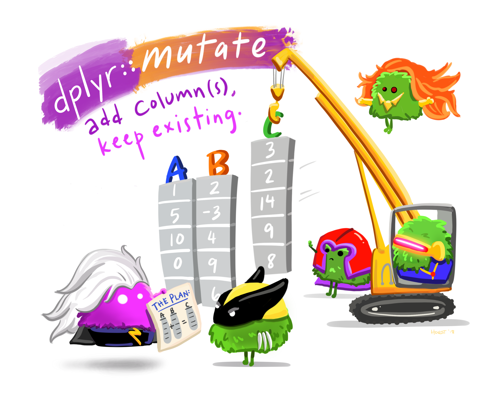

```{webr-r}
#| context: setup

library(dplyr)
library(readr)

url <- "https://raw.githubusercontent.com/yann-ryan/infovis-course/master/titanic_df_full.csv"
download.file(url, "titanic_df.csv")

titanic_df =  read_csv('titanic_df.csv')

```

{fig-alt="Cartoon of cute fuzzy monsters dressed up as different X-men characters, working together to add a new column to an existing data frame. Stylized title text reads \"dplyr::mutate - add columns, keep existing.\"" width="600"}

There are many situations when we might want to add new columns to a dataframe by doing a calculation on existing columns.

As a simple example in our Titanic dataset, imagine you wanted to calculate (and visualise) the ticket fares in today's value. Assuming the fare is in British pounds, we could look up the value of single pound in (around) 1912, and use this to calculate how much it would cost in today's currency.

According to the [National Archives Currency Converter](https://www.nationalarchives.gov.uk/currency-converter/), 1 pound in 1910 is worth 78.17 today. Therefore, we can calculate the value by multiplying a value in the fare column by 78.17.

We can do this on the entire Fare column using another verb, called `mutate`. This verb will create a new column in the dataset, based on our instructions. This could be anything from a simple formula (multiply the value by 78.17) to very complex formulas or algorithms.

Similar to filter(), we use mutate() by first providing the dataset, followed by the pipe, then the verb mutate and within the brackets, we enter the new column name and an equal sign, followed by the instructions. In this case, the instructions are to take the Fare column and multiply it by 78.17, using `*`.

```{webr-r}
titanic_df |> 
  mutate(price_today = fare * 78.17 ) |>
  select(name, fare, price_today)
```

If you look at the output of the code above, you'll see a new column, called 'price_today', containing the new price.

### Using existing functions

You can also use existing functions with mutate. In our dataset, the age is given in decimal, but you want to round to the nearest whole number. There is a simple function in R called `round()` which will do this.

Write code to create a new column called `age_in_years` with `mutate()`. Use the `round()` function on the `Age` column, like this:

```{webr-r}
titanic_df |> 
  mutate(age_in_years = round(age)) |> 
  select(name, age, age_in_years)
```

### if_else and case_when

A useful way of using mutate() is to create a new column which is different depending on some conditions. Lets say you want to create a bar chart counting the adult and child passengers on the titanic separately. Currently, there is no column containing this information. However, we could make one using the age column and a function called `if_else`. Using `if_else` within `mutate()` will create a new column containing different information depending on your condition.

In this case, we want to create a new column, called 'status'. In this column, we want to enter 'child' if the number in the age column is less than 18, and otherwise we want to enter 'adult'. This is done like this:

```{webr-r}

titanic_df |> 
  mutate(status = if_else(age < 18, 'child', 'adult'))

```

You can use `case_when()` where you have more complicated scenarios. An example is this:

```{webr-r}

titanic_df |> 
  mutate(status = 
           case_when(
            age <13 ~ "child",
            age >12 & age <20 ~ "teenager",
            age>20 ~ "adult"
           ))

```

### Exercises:

-   You've just been told that the Age in the dataset was calculated incorrectly - it was underestimated by five years. Create a new column in the dataset called corrected_age, with the new value.

```{webr-r}

```

-   Use the Age (or age_in_years) column to calculate the approximate year of birth for passengers (the Titanic sank in 1912. You can use `round()` on your new column, or you can leave it as a decimal.

```{webr-r}

```

-   Who paid the highest fare, and what was it in today's money? Use the methods you learned in the previous pages to select the name and fare in today's money of the highest-paying passenger.

```{webr-r}

```
