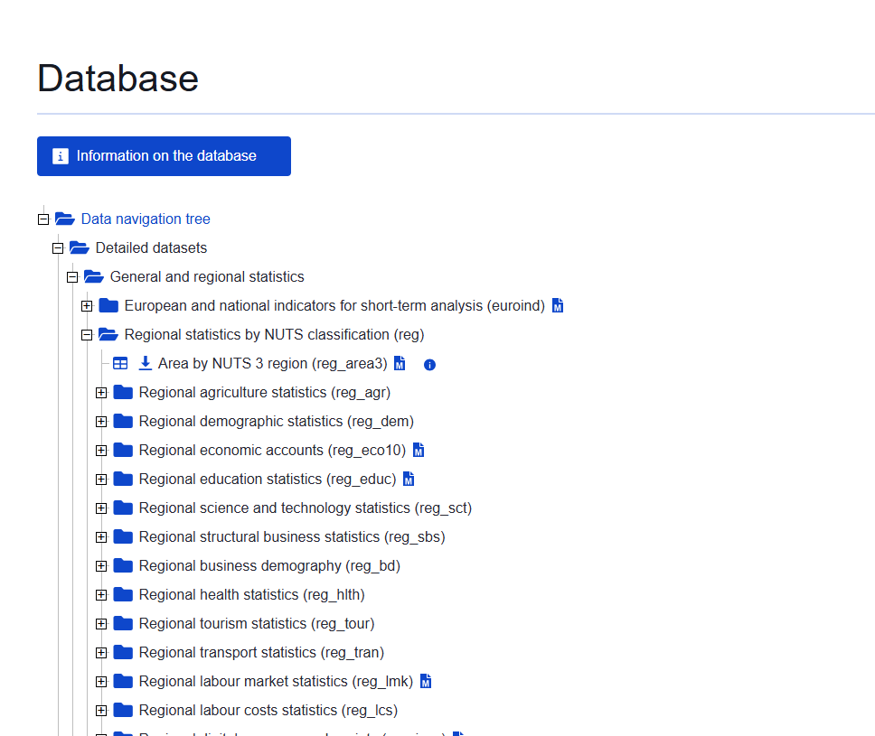

## Last week: Choropleth or Thematic Map

```{r}
#| echo: false
#| message: false
#| warning: false

library(tidyverse)
library(rnaturalearth)
library(sf)
library(usmap)

sf_use_s2(FALSE)

us = usmap::us_map(regions =  'states')

pov = usmap::statepov

us |> left_join(pov) |> 
  ggplot() + geom_sf(aes(fill = pct_pov_2021)) + scale_fill_viridis_c()

```

## Today: Points maps (plus faceting)

```{r}
#| echo: false
#| message: false
#| warning: false
#| context: setup

library(tidyverse)
library(rnaturalearth)
library(sf)

sf_use_s2(FALSE)

worldmap = ne_countries(scale = 'medium', returnclass = 'sf')

nobel_laureates = read_csv('nobel-prize-winners.csv')


nobel_laureates_sf = st_as_sf(nobel_laureates |> 
                                filter(!is.na(bornLong)), 
                              coords = c('bornLong','bornLat' ), 
                              crs = 4326,na.fail = FALSE)

summarised_data = nobel_laureates_sf |>
  group_by(bornCity_now, category) |> summarise(n = n())

worldmap = ne_countries(scale = 'medium', returnclass = 'sf')

ggplot() +   
  geom_sf(data = worldmap,fill = 'gray90') + 
  geom_sf(data = summarised_data, aes(size = n, color = category), alpha = .9, show.legend = "point")+
  coord_sf(xlim = c(-10, 30), ylim = c(37, 60)) + 
  facet_wrap(~category) + theme_bw()
```
## Difference:

-   Thematic good for countries, states, regions
-   Points map for cities, individual addresses.

## Steps:

-   Start with longitude and latitude coordinates
-   Convert to simple features object
-   Visualise with ggplot
-   Add a base map. 


## Coordinates
-   Your data needs a column containing longitude and latitude, in decimal format
-   Data in one column? use `separate()`

## Making a simple features object
-   use the function `st_as_sf()`
-   Specify the coordinates columns using `coords = `
-   Specify the Coordinate Reference System using `crs = 4326`. 


```{r}
#| warning: false 
#| #| error: false 
#| #| message: false  


library(dplyr) 
library(sf)  
library(readr)
library(ggplot2)

nobel_laureates = read_csv('nobel-prize-winners.csv')

```

## Create the sf object using the following code:

```{r}
#| warning: false 
#| #| error: false 
#| #| message: false   

nobel_laureates_sf = st_as_sf(nobel_laureates |> 
                                filter(!is.na(bornLong)), 
                              coords = c('bornLong','bornLat' ), 
                              crs = 4326,na.fail = FALSE)


```

## Map with ggplot and geom_sf

Turning this into a basic map is very simple, and follows the syntax from previous weeks, using `geom_sf`.

```{r}
#| warning: false 
#| #| error: false 
#| #| message: false   

ggplot() +    
  geom_sf(data = nobel_laureates_sf)

```


## Summarise the geographic object


```{r}
#| warning: false 
#| #| error: false 
#| #| message: false   

summarised_data = nobel_laureates_sf |>
  group_by(bornCity_now) |> summarise(n = n())

```

## Mapping

```{r}
#| warning: false 
#| #| error: false 
#| #| message: false
   
ggplot() +   
  geom_sf(data = summarised_data |> filter(!is.na(n)), aes(size = n), shape = 21, show.legend = "point")

```

## Adding further variables


```{r}
#| warning: false 
#| #| error: false 
#| #| message: false 
 
summarised_data = nobel_laureates_sf |> group_by(bornCity_now, category) |> summarise(n = n())

```


## `show.legend = "point"` 

```{r}
#| warning: false 
#| #| error: false 
#| #| message: false  

ggplot() +   
  geom_sf(data = summarised_data, aes(size = n, color = category), alpha = .5, show.legend = "point")

```

## Adding a basemap.


```{r}
library(rnaturalearth)

worldmap_coast = ne_coastline(scale = 'medium', returnclass = 'sf')
```

## Add to your map

```{r}

ggplot() +   
  geom_sf(data = worldmap_coast) + 
  geom_sf(data = summarised_data, aes(size = n, color = category), alpha = .5, show.legend = "point")

```

## 'Zooming in' on your map


```{r}
ggplot() +   
  geom_sf(data = worldmap_coast) + 
  geom_sf(data = summarised_data, aes(size = n, color = category), alpha = .9, show.legend = "point") +
  coord_sf(xlim = c(-10, 30), ylim = c(37, 60)) + theme_void()


```

## Faceting

-   use `facet_wrap()`
-   Specify variable or variables with `~` in between

```{r}
ggplot() +   
  geom_sf(data = worldmap_coast) + 
  geom_sf(data = summarised_data, aes(size = n, color = category), alpha = .9, show.legend = "point")+
  coord_sf(xlim = c(-10, 30), ylim = c(37, 60)) + facet_wrap(~category)

```


## In-class exercise 1:

Make a points map using the 'extinct languages' dataset in Posit.

-   Add a basemap using RNaturalEarth

-   Restrict the map to a chosen area

-   Colour the data by the endangered status.

## In class exercise 2:

The following is a good example of the kind of real-world workflow in making a map from external data, including the kinds of problems with matching and cleaning you'll often encounter.

Using the [eurosat database](https://ec.europa.eu/eurostat/data/database), choose a dataset to visualise. You want to choose something from Detailed datasets -\> General and Regional Statistics -\> Regional statistics by NUTS classification (reg), as in the screenshot here:



-   Download a shapefile of the NUTS regions from the [official EU site](https://ec.europa.eu/eurostat/web/gisco/geodata/statistical-units/territorial-units-statistics). Choose the least-detailed scale so you don't run into computer memory problems. Select the ESPG: 4326 CRS.

-   Upload these files to Posit cloud (or keep on your local machine if you're running R there).

-   Make a map. Start by selecting a single year and shading each region by the colour of your dataset.

See how far you can get with the following:

-   Use a fill colour palette which more easily distinguishes the lower and higher values.

-   Use theming to remove unwanted elements of the map.

-   Adjust the coordinate limits to focus on the main region of Europe, ignoring the Atlantic islands.

-   The map looks a little strange with missing regions and countries (i.e the UK). How could we solve this, so they are at least present, but perhaps grayed out?

-   **Try this extra challenge:** make a version which creates a series of mini-maps, one for each year in the data. To do this you'll need to `pivot` your data so that it is in a 'long' format, with each data point for each year in a single row, and use a function called `facet_wrap()`.