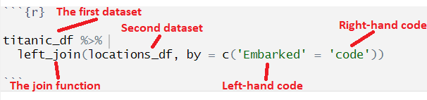

```{webr-r}
#| context: setup

library(tidyverse)


url <- "https://raw.githubusercontent.com/yann-ryan/infovis-course/master/titanic_df_full.csv"
download.file(url, "titanic_df.csv")

titanic_df =  read_csv('titanic_df.csv')

```

# Grouping

## Groups

-   Grouping on a variable (a column) we combine the data based on that variable (or variables)
-   Some functions will then be carried out on each group separately

## Groups


## Grouping

```{webr-r}
titanic_df |> 
  group_by(sex) 
```

## Groups with multiple variables

```{webr-r}
titanic_df |> 
  group_by(pclass, sex) 

```

## Try it yourself:

-   Group the dataset by the embarked and age variables

```{webr-r}

```

## Grouping and summarise()

-   summarise **calculates a summary for each group in a dataset**

```{webr-r}
titanic_df |> 
  group_by(sex) |> 
  summarise(total = n())
```

## Try it yourself

-   Calculate the average age of male and female passengers separately - call the new summary column 'average_age'.

```{webr-r}

```

## Other summarise functions {.smaller}

There are lots of other functions that work with groups and summarise. Here is a list of the most useful:

-   Center: [`mean()`](https://rdrr.io/r/base/mean.html), [`median()`](https://rdrr.io/r/stats/median.html)

-   Spread: [`sd()`](https://rdrr.io/r/stats/sd.html), [`IQR()`](https://rdrr.io/r/stats/IQR.html), [`mad()`](https://rdrr.io/r/stats/mad.html)

-   Range: [`min()`](https://rdrr.io/r/base/Extremes.html), [`max()`](https://rdrr.io/r/base/Extremes.html),

-   Position: [`first()`](https://dplyr.tidyverse.org/reference/nth.html), [`last()`](https://dplyr.tidyverse.org/reference/nth.html), [`nth()`](https://dplyr.tidyverse.org/reference/nth.html),

-   Count: [`n()`](https://dplyr.tidyverse.org/reference/context.html), [`n_distinct()`](https://dplyr.tidyverse.org/reference/n_distinct.html)

-   Logical: [`any()`](https://rdrr.io/r/base/any.html), [`all()`](https://rdrr.io/r/base/all.html)

## Multiple summarise functions

You can also calculate multiple summaries in a single function:

```{webr-r}

titanic_df |> 
  group_by(sex) |> 
  summarise(total = n(), maximum = max(age, na.rm = TRUE)) # calculate the total number and the maximum age for each category.
```

## groups and slice\_

```{webr-r}

titanic_new_df |> 
  group_by(pclass) |>
  slice_max(order_by = age, n = 5)

```

## Try it yourself

-   Calculate the five youngest passengers for each passenger class and embarked location

```{webr-r}


```

## Grouping with mutate()

-   You can also use group_by with mutate(). In this case, it will add the total for each group as a new column, and not remove anything else.

```{webr-r}
titanic_new_df |> 
  group_by(pclass) |>
  mutate(total_class = n())
```

# Exercises

## Try it yourself

-   Calculate the total number of passengers by both sex and pclass

```{webr-r}

```

## Try it yourself

-   The embarked column indicates where the passengers got onto the ship. The code is C = Cherbourg, Q = Queenstown (Cobh in Ireland today), S = Southampton.

-   How many passengers got on at each location?

```{webr-r}

```

## Try it yourself

-   What was the average fare paid for each location?

```{webr-r}

```

## Try it yourself

Create a new column, containing the total number which embarked from that location

```{webr-r}


```

Who are the five youngest male and female passengers who embarked at each location?

```{webr-r}

```

# Joins

## Join

-   Merging together datasets using a 'common key'
-   Often used to augment one dataset with further information
-   Example: we have an additional table containing further information the embarked places

```{webr-r}
locations_df
```

## The join function

-   Needs a key: a common column to both datasets

```{webr-r}
titanic_df |>
  left_join(locations_df, by = c('embarked' = 'code'))
```

## The join function

{width="300"}

## Try it yourself

-   Calculate the number of men and women which embarked from each country,
-   First merge the new table with the existing one.
