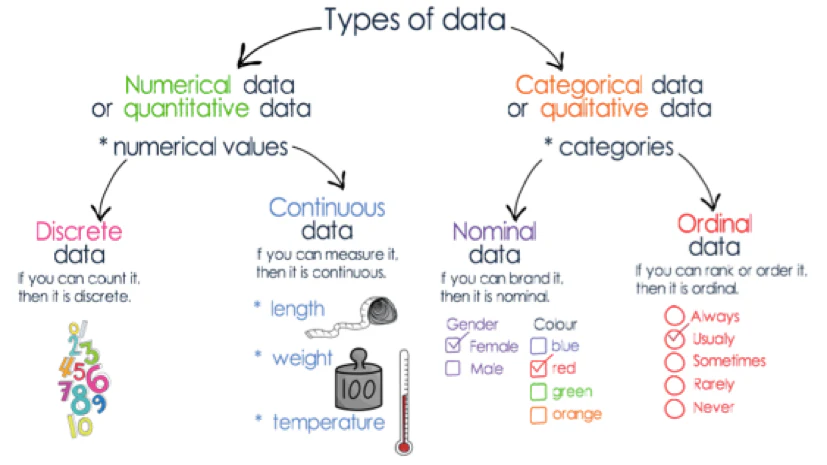
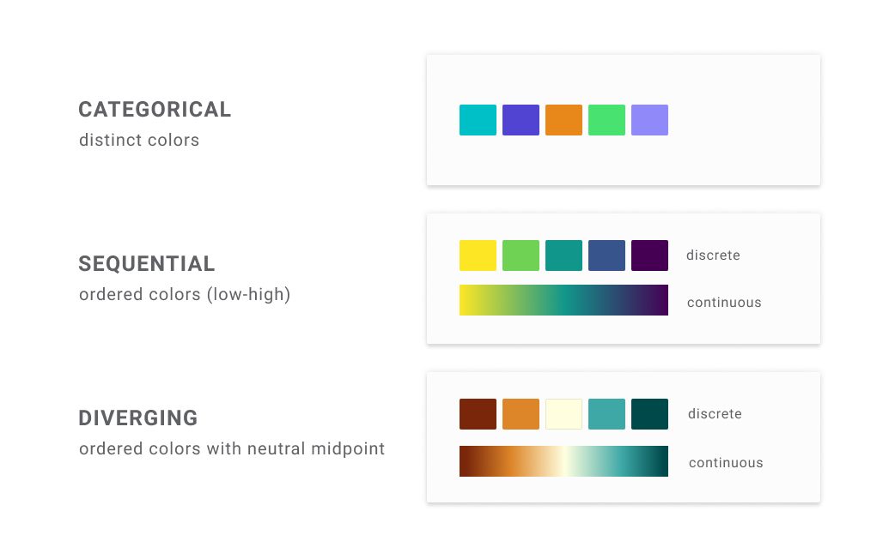

## Today

-   Data visualisation principles
-   How ggplot2 works
-   How to create basic chart types
-   Datavis challenge

## Aims of Information Design

-   Understand, explore and remember information
-   Take in large amounts of data at once
-   Make comparisons
-   Read millions of data points or understand complex structures (e.g.hierarchies or networks)
-   Understand temporal information, e.g.logic of going from earlier to later time

## Why it works

-   We make judgements on values based on visual elements
-   Bigger = larger values
-   Hotter \> colder
-   Transparent = 'weak'

Mapping data to visual elements allows us to exploit this

## Mapping data to aesthetics

-   Data visualisation can be summed up as a process of mapping ***data*** to the ***aesthetics*** of certain geometries.
-   **Geometries**: basic geometric shapes such as lines, points, circles, polygons
-   **Aesthetics**: features of those shapes

## Aesthetics

{width="600"}

Another important one not pictured here is *transparency.*

## Discrete vs continuous aesthetics

-   Most aesthetics work on either discrete or continuous scales.
-   Think of scales as either representing sequential numbers (continuous) or distinct numbers or categories (discrete or categorical).

## Discrete vs continuous aesthetics

{width="600"}

## Data types in R

-   Continuous: <dbl>
-   Categorical: <str>
-   Discrete: <int>
-   Ordinal: <fct>

## What does this mean for aesthetics?

-   Some aesthetics only work on one or the other (shapes can only represent categories, for instance).
-   In other cases, the scale will work differently depending on whether it is applied to a discrete or continuous set of data.
-   In the example of colour, below, a categorical scale is usually represented by distinct, unrelated colours, whereas a continuous scale is sequential range, running from yellow to green.

## What does this mean for aesthetics?

{width="500"}

# Key Aesthetics

## Position

```{r}
#| code-fold: true
#| message: false
#| warning: false

library(tidyverse)

gapminder_df =  read_tsv('gapminder_df.csv') |> filter(continent!= 'FSU')

gapminder_df |>
  filter(year == 2002) |>
  ggplot(aes(x = lifeExp, y = gdpPercap )) +
  geom_point()
```

## Size

```{r}
#| code-fold: true
#| message: false
#| warning: false

options(scipen = 999999)
gapminder_df |>
  filter(year == 2002) |>
  mutate(pop = pop/1000000) |>
  ggplot(aes(x = lifeExp, y = gdpPercap, size = pop)) +
  geom_point() + 
  scale_size_area(max_size = 10) +
  labs(size = "Population (in millions)") 


```

## Colour

```{r}
#| code-fold: true
#| message: false
#| warning: false


gapminder_df |>
  filter(year == 2002) |>
  mutate(pop = pop/1000000) |>
  ggplot(aes(x = lifeExp, y = gdpPercap, size = pop, color = continent)) +
  geom_point() + 
  scale_size_area(max_size = 10) +
  labs(size = "Population (in millions)") 

```

## Shape

```{r}
#| code-fold: true
#| message: false
#| warning: false

gapminder_df |>
  filter(year == 2002) |>
  mutate(pop = pop/1000000) |>
  ggplot(aes(x = lifeExp, y = gdpPercap, size = pop, shape = continent)) +
  geom_point() + 
  scale_size_area(max_size = 10) +
  labs(size = "Population (in millions)") 

```

## Linetype/width

```{r}
#| code-fold: true
#| message: false
#| warning: false

gapminder_df |>
  filter(country %in% c('Netherlands', 'France', "Germany", "Italy", "Belgium")) |>
  count(year, country, wt = lifeExp) |>
  ggplot() + 
  geom_line(aes(x = year, y = n, linetype = country)) + 
  labs(title = "Life Expectancy", subtitle = "Select Countries, 1952 - 2007") + 
  theme_bw()


```

## Transparency

```{r}
#| code-fold: true
#| message: false
#| warning: false

gapminder_df |>
  filter(year == 2002) |>
  mutate(pop = pop/1000000) |>
  ggplot(aes(x = lifeExp, y = gdpPercap, size = pop, fill = continent)) +
  geom_point(alpha = .5, pch = 21, color = 'black') + 
  scale_size_area(max_size = 10) +
  labs(size = "Population (in millions)") 

```
