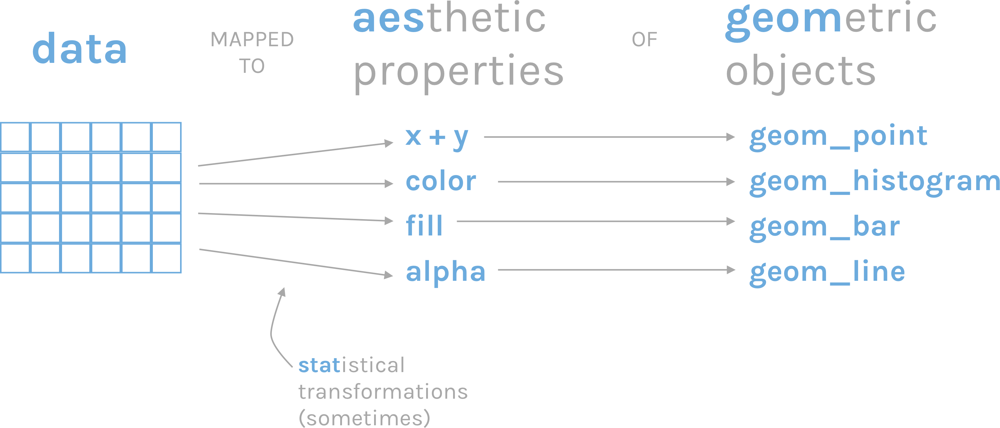
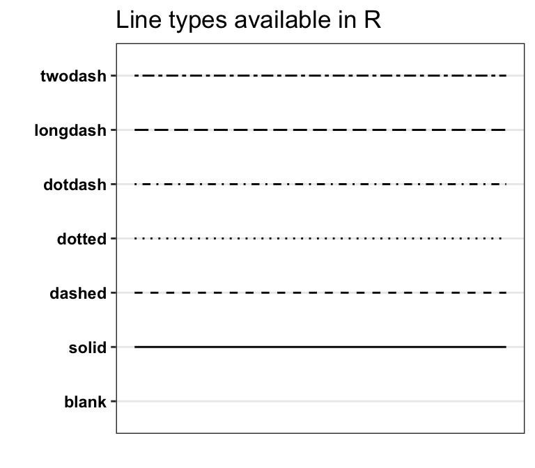

```{webr-r}
#| context: setup


library(readr)
library(dplyr)
library(ggplot2)


url <- "https://raw.githubusercontent.com/yann-ryan/infovis-course/master/titanic_df_full.csv"
download.file(url, "titanic_df.csv")

titanic_df =  read_csv('titanic_df.csv')


url <- "https://raw.githubusercontent.com/jennybc/gapminder/refs/heads/main/data-raw/04_gap-merged.tsv"
download.file(url, "gapminder_df.csv")

gapminder_df =  read_tsv('gapminder_df.csv') |> filter(continent!= 'FSU')

```

# Using ggplot2

[{width="500"}](https://github.com/allisonhorst/stats-illustrations?tab=readme-ov-file)

## The ggplot2 package {.smaller}

-   We'll use this to pass our data to geometries and aesthetics
-   It allows you to create almost anything!


## The 'grammar of graphics'

-   Philosophy of visualisation
-   Set of rules by which we can construct visualisations using a standard set of terms and principles
-   It's a 'grammar' because all visualisation types are constructed in the same way
-   You don't need to learn different features for each chart type

## A set of layers


# Demonstration - making a bar chart

## Summarise the data

```{webr-r}

df <- titanic_df |>
  group_by(sex) |>
  summarise(n = n())
  
df
  
```

## Making a plot



## Add ggplot function and data

```{webr-r}

  
```

## Add required aesthetics

```{webr-r}

```

## Add a geometry

```{webr-r}


```

## Outside the aes()

```{webr-r}
ggplot(data = df, aes(x = sex, y = n)) + 
  geom_col(fill = 'red')
```

## Try it yourself

Set the outline of this bar chart to black (first copy and paste the existing code), and the linewidth to 2:

```{webr-r}

```

## Inside aes()

If you set an attribute *within* the aes(), you will *set that aesthetic to a value from your dataframe.*

```{webr-r}
df2 = titanic_df |>
  group_by(sex, embarked) |>
  summarise(n = n())

df2

```

## Inside aes()

```{webr-r}

ggplot(data = df2, aes(x = sex, y = n, fill = embarked)) + 
  geom_col()

```

## Special geometry options

```{webr-r}

ggplot(data = df2, aes(x = sex, y = n, fill = embarked)) + 
  geom_col(position = 'dodge')

```

## Try it yourself

Take your chart with the outline black and the linewidth at 2, set the `linetype` aesthetic to the `embarked` category:

```{webr-r}


```

## Categorical vs continuous variables

```{webr-r}

df3 <- titanic_df |>
  group_by(embarked) |>
  summarise(avg_paid = mean(fare, na.rm = TRUE), n = n()) 

df3
```

## Categorical vs continuous variables

```{webr-r}

ggplot(data = df3, aes(x = embarked, y =n, fill = avg_paid)) + 
  geom_col()

```

# Chart types

## Gapminder dataset

```{webr-r}

gapminder_df

```

## Controlling aesthetics

-   To draw other chart types, replace the geometry `geom_col` with others. In some cases, we will also change or add aesthetics.

-   Below are examples of different geometries, and the most relevant aesthetics

## Geom_point()

`geom_point()` places points on a 2D plane.

```{webr-r}

gapminder_df |>
  filter(year == 2007) |>
ggplot(aes(x = lifeExp, y = gdpPercap)) + 
  geom_point()

```

## Size

We can optionally set the `size` variable.

## Outside the aes()

```{webr-r}

gapminder_df |>
  filter(year == 2007) |>
ggplot(aes(x = lifeExp, y = gdpPercap)) + 
  geom_point(size = 5)

```

## Inside the aes()

```{webr-r}

gapminder_df |>
  filter(year == 2007) |>
ggplot(aes(x = lifeExp, y = gdpPercap, size = pop)) + 
  geom_point()

```

## Try it yourself: {.smaller}

Make a new version of the plot, for the year 2002. Set the population to the x axis, the life expectancy to the y axis, and the GDP to the size variable.

```{webr-r}

```

## Colour

```{webr-r}

gapminder_df |>
  filter(year == 2007) |>
ggplot(aes(x = lifeExp, y = gdpPercap, size = pop)) + 
  geom_point(color = 'red')


```

## Inside aes()

```{webr-r}

gapminder_df |>
  filter(year == 2007) |>
ggplot(aes(x = lifeExp, y = gdpPercap, size = pop,color = continent)) + 
  geom_point()


```

## Try it yourself

Create a plot with the points all the same colour: `forestgreen`. You need to choose where the aesthetic should go, out of the two examples above!

```{webr-r}

```

## Alpha

Alpha sets the transparency, a number between 0 and 1:

```{webr-r}
gapminder_df |>
  filter(year == 2007) |>
ggplot(aes(x = lifeExp, y = gdpPercap, size = pop,color = continent)) + 
  geom_point(alpha = .5)
```

## Shape

{width="300"}

## Shape

```{webr-r}
gapminder_df |>
  filter(year == 2007) |>
ggplot(aes(x = lifeExp, y = gdpPercap)) + 
  geom_point(shape = 2)
```

## Shape

```{webr-r}
gapminder_df |>
  filter(year == 2002) |>
ggplot(aes(x = lifeExp, y = gdpPercap, size = pop,shape =  continent)) + 
  geom_point()
```

## Geom_line

geom_line will draw a line between points in the order of the variable on the x axis

```{webr-r}
gapminder_df |> 
  filter(country == 'Netherlands') |>
  ggplot(aes(x = year, y = lifeExp)) + 
  geom_line()
```

## Try it yourself

Draw a similar plot, for a country in the dataset of your choice.

```{webr-r}

```

## Colour

```{webr-r}
gapminder_df |> 
  filter(country == 'Netherlands') |>
  ggplot(aes(x = year, y = gdpPercap)) + 
  geom_line(color = 'forestgreen')
```

## Colour (groups)

```{webr-r}
gapminder_df |> 
  filter(country %in% c('Netherlands', 'France', 'Germany', 'Spain', 'United Kingdom')) |>
  ggplot(aes(x = year, y = gdpPercap)) + 
  geom_line()
```

## Linetype

{width="400"}

## Linetype

```{webr-r}
gapminder_df |> 
  filter(country == 'Netherlands') |>
  ggplot(aes(x = year, y = gdpPercap)) + 
  geom_line(linetype = 'dashed')
```

## Linetype

```{webr-r}
gapminder_df |> 
  filter(country %in% c('Netherlands', 'France', 'Germany', 'Spain', 'United Kingdom')) |>
  ggplot(aes(x = year, y = gdpPercap, linetype = country)) + 
  geom_line()
```

## Multiple geoms

You can stack multiple geoms on top of each other, just add them using another `+`:

```{webr-r}
gapminder_df |> 
  filter(country == 'Netherlands') |>
  ggplot(aes(x = year, y = lifeExp)) + 
  geom_line() + 
  geom_point()
```

## Add-ons

Many additional packages use the same 'grammar of graphics' to extend ggplot. - You can make animated plots using `gganimate`, networks using `ggraph`. - Later in the course we will create maps with a geom called `geom_sf`. - There are hundreds of these add-ons, which you can browse at https://exts.ggplot2.tidyverse.org/gallery

## Today's challenge

-   Open Posit
-   Find a story in the data and tell it with visualisations
-   First step is to merge the data tables
