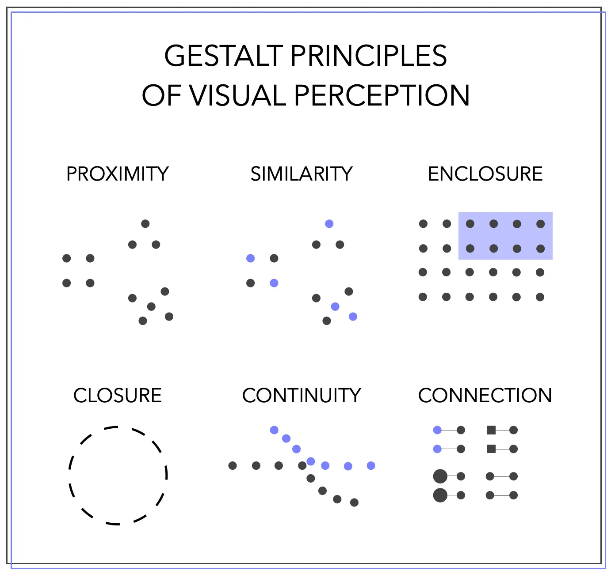

```{webr-r}
#| context: setup
library(readr)
library(dplyr)
library(ggplot2)
library(gapminder)

gapminder_df =  gapminder |> filter(continent!= 'FSU')

sample_for_bar_chart <- gapminder_df %>% 
  filter(year == 2007) |>
  filter(country %in% c('Netherlands', 'France', 'Germany','Mexico', 'Chile', 'Colombia', 'Bolivia', 'Japan', 'China')) 


```


## Scales

-   Data visualisation is mapping data to aesthetics

```{webr-r}
gapminder_df |>
  filter(year == 2007) |>
ggplot(aes(x = lifeExp, y = gdpPercap, size = pop,color = continent)) + 
  geom_point()
```

## Scales

-   The process by which this happens involve **scales**.
-   **Scales** are the next 'layer' in our ggplot object.

{width="500"}

## Scales

-   Scales **control the mapping from data to aesthetics**.
-   Data visualisations cannot work without scales, so ggplot2 will automatically add them to your plots
-   Knowing how to control these and the various options they have available will allow you to have much more control over the look of your visualisations.

## Scales  

```{webr-r}
gapminder_df |>
  filter(year == 2007) |>
ggplot(aes(x = lifeExp, y = gdpPercap, size = pop,color = continent)) + 
  geom_point()
```

## Adding or changing scales:

-   Add the appropriate scale name after `+` to your ggplot object. Specify options within parentheses.
-   Scales are named scale\_{aesthetic name}\_{scale name}, e.g. `scale_color_gradient2`

## Position scales

-   The most common position scales are `scale_x_continuous` and `scale_y_continuous`, which simply map linearly from a data value to a location on the plot.

## Position scales

```{webr-r}

gapminder_df |>
  filter(country == "Netherlands") |>
  ggplot(aes(x = year, y = gdpPercap )) +
  geom_line()


```

## What can be changed?

-   **Limits** specify the limits of the scale - the start and end points of the x and y axes.

-   **Breaks** specify which points and ticks should be drawn on the x and y axes.

## Limits

To change the limits, add `limits =` followed by the start and end point of the limit you want, within a vector using `c()`, as in the example below:

## Limits

```{webr-r}
gapminder_df |>
  filter(country == "Netherlands") |>
  ggplot(aes(x = year, y = gdpPercap )) +
  geom_line() + 
  scale_x_continuous(limits = c(1980, 2000))
```

## Try it yourself

Set the limits of the y axis to 10000 and 50000

```{webr-r}

```

## Breaks

-   Breaks control which axis ticks, lines and labels are shown.
-   Ggplot picks defaults according to the data but you can override them.

## Breaks

```{webr-r}
gapminder_df |>
  filter(country == "Netherlands") |>
  ggplot(aes(x = year, y = gdpPercap )) +
  geom_line() + 
  scale_x_continuous(limits = c(1980, 2000), 
                     breaks = c(1980, 1990, 2000)) 
```

## Try it yourself

Set the breaks for the y axis to every 5000 instead of 10000

```{webr-r}

```

## Scales with bar charts

Continuous:

```{webr-r}

gapminder_df |>
  filter(country == "Netherlands") |>
  ggplot(aes(x = year, y = gdpPercap )) +
  geom_col() 
```

## Discrete

```{webr-r}

gapminder_df |>
  filter(country %in% c("Netherlands", "Germany", "France")) |> filter(year == 2007) |>
  ggplot(aes(x = country, y = gdpPercap )) +
  geom_col() 

```

## Colour scales with continuous and discrete data

Mapping **categorical** data will result in a **discrete** scale, by default `scale_colour_discrete` or `scale_fill_discrete`. With this scale, ggplot will choose colours with the aim of making them as distinct from each other as possible.

Mapping **numerical** data will result in a **continuous** scale, by default `scale_colour_continuous` or `scale_fill_continuous`. With this scale, ggplot will choose a colour range where one end of the hue or saturation will be mapped to high values and the other end to low values.

## Numerical/Continuous:

```{webr-r}
 sample_for_bar_chart |> 
  ggplot(aes(x = country, y = gdpPercap, fill = lifeExp)) +
  geom_col()
```

## String/Categorical/discrete

```{webr-r}
sample_for_bar_chart |>
  ggplot(aes(x = country, y = gdpPercap, fill = continent)) +
  geom_col()
```

## Built in scales

```{webr-r}
sample_for_bar_chart |> 
  ggplot(aes(x = country, y = gdpPercap, fill = lifeExp)) +
  geom_col() + 
  scale_fill_viridis_c()
```

## Create a scale from a palette

Use `scale_color_distiller` to specify that ggplot should take a particular palette and distribute the values evenly along it.

```{webr-r}
sample_for_bar_chart |> 
  ggplot(aes(x = country, y = gdpPercap, fill = lifeExp)) +
  geom_col() + 
  scale_fill_distiller(palette = "RdPu")
```

## Try it yourself:

Change the palette of this chart to 'Greens':

```{webr-r}

```

## Create your own continuous scale

`scale_color_gradient` will create a gradient colour scale in between two colours you specify.

```{webr-r}
sample_for_bar_chart |> 
  ggplot(aes(x = country, y = gdpPercap, fill = lifeExp)) +
  geom_col() + 
  scale_fill_gradient(low = 'firebrick', high ='gold')
```

## scale_gradient2

An alternative is to use `scale_gradient2()`, which allows you to specify 3 colours, a low, mid and high. The function will create a scale similar to above but with a specified midpoint:

```{webr-r}

sample_for_bar_chart |> 
  ggplot(aes(x = country, y = gdpPercap, fill = lifeExp)) +
  geom_col() + 
  scale_fill_gradient2(low = 'firebrick', mid = 'white', high ='gold', midpoint = 75)

```

## Discrete scales

Discrete scales can also use 'built in' scales. The version of scale_fill_viridis for discrete scales is called `scale_fill_viridis_d`:

```{webr-r}
sample_for_bar_chart |> 
  ggplot(aes(x = country, y = gdpPercap, fill = continent)) +
  geom_col() + 
  scale_fill_viridis_d()
```

## Create from a palette

The equivalent method for picking a scale from an existing palette is to use `scale_fill_brewer`. Again, choose a palette from the list supplied above:

```{webr-r}
sample_for_bar_chart |> 
  ggplot(aes(x = country, y = gdpPercap, fill = continent)) +
  geom_col() +
  scale_fill_brewer(palette = 'Set2')
```

## Try it yourself

-   Change the chart above:
-   Use `scale_fill_brewer()` to another palette. Go to https://colorbrewer2.org/ and choose one from the 'qualitative' options. 

## Fully manual scales

Finally, with discrete scales you can simply pick your own set of colours, using `scale_fill_manual`:

```{webr-r}
sample_for_bar_chart |> 
  ggplot(aes(x = country, y = gdpPercap, fill = continent)) +
  geom_col() + 
  scale_fill_manual(values = c('firebrick', 'forestgreen', 'orange'))
```

## Size scales

The most frequent use of the size aesthetic is to set the size of points in a scatterplot to a continuous variable.

The size scale is controlled by default by `scale_size`. This maps values to the area of a point, linearly.

```{webr-r}
gapminder_df |>
  filter(year == 2007)|>
  ggplot(aes(x = lifeExp, y = gdpPercap, size = pop)) + 
  geom_point()
```

## scale_size_area()

On small tip is to replace `scale_size` with `scale_size_area()`, which ensure that values of 0 are mapped to zero, instead of starting with the smallest value. You can also set the `max_size =` argument within this scale to get a range of sizes you are happy with.

```{webr-r}
gapminder_df |>
  filter(year == 2007)|>
  ggplot(aes(x = lifeExp, y = gdpPercap, size = pop)) + 
  geom_point() + 
  scale_size_area(max_size = 10)
```


## Adjusting the legend

As with position scales, we can set limits and breaks. In this case, we'll see the change in the legend primarily.

To set the limit, specify within the scale_x\_ or scale_y function you are using. In this, any values outside the limits will be coloured by a default NA value, in this case grey.

```{webr-r}
sample_for_bar_chart |> 
  ggplot(aes(x = country, y = gdpPercap, fill = lifeExp)) +
  geom_col() + 
  scale_fill_continuous(limits = c(70,100))
```

## Set the breaks using the below:

```{webr-r}
sample_for_bar_chart |> 
  ggplot(aes(x = country, y = gdpPercap, fill = lifeExp)) +
  geom_col() + 
  scale_fill_continuous(breaks = c(50:80))
```

## Adjusting the legend

You can make changes to the legend in other ways, using the `guides()` layer. This allows you to customise the legend to look exactly how you would like it. 

Within the guides() layer, you specify the scale you want to work with (e.g. the fill scale), and then the type of guide  you would like to use, using `guide_`. The options are `guide_colorbar()`, `guide_legend()`, `guide_bins()` and `guide_colorsteps()`

## Adjusting the legend

```{webr-r}
sample_for_bar_chart |> 
  ggplot(aes(x = country, y = gdpPercap, fill = lifeExp)) +
  geom_col()  + 
  guides(fill = guide_colorbar(reverse = TRUE))


```

## Adjusting the legend

-   Use `barheight` to set the height of the legend (you can use barwidth to set the width):

```{webr-r}
sample_for_bar_chart |> 
  ggplot(aes(x = country, y = gdpPercap, fill = lifeExp)) +
  geom_col() + 
  guides(fill = guide_colourbar(barheight = unit(8, "cm")))


```

Change from vertical to horizontal:

```{webr-r}
sample_for_bar_chart |> 
  ggplot(aes(x = country, y = gdpPercap, fill = lifeExp)) +
  geom_col() + 
  guides(fill = guide_colourbar(direction = "horizontal"))
```

## Try it yourself:

-   Recreate the chart above. 
-   Change the guide to `guide_legend()`.
-   Use the option nrow to specify it should be in two rows. 
-   Use the option `position` to position the legend on the `left`


# Gestalt Principles

## Gestalt Principles {.smaller}

-   Gestalt principles were developed from the late 1800s and could be considered part of the discipline of psychology and philosophy.
-   Gestalt principles are related to **perception:** the basic theory is that we perceive visual forms as a whole, rather than each part separately.
-   In other words, we simplify our visual stimuli in order to make sense of what we are seeing, and the wider world.
-   The developers of Gestalt boiled this down to a series of principles, which they say govern how we do this simplifcation.
-   The data visusalisation types and default settings we use naturally use these principles - we don't need to actively think about them most of the time.

## Principles

{width="1000"}

## Proximity

When objects are placed close together, our mind intuitively infers a connection between them.

```{r}
#| echo: false
#| message: false
#| warning: false

library(palmerpenguins)
library(tidyverse)

palmerpenguins::penguins %>% 
  ggplot() + geom_point(aes(x = bill_length_mm, y = flipper_length_mm))
```

## Similarity

This principle states that objects which are a similar (or the same) size, shape or colour will be perceived as part of the same group.

```{r}
#| echo: false
#| message: false
#| warning: false
palmerpenguins::penguins %>% 
  ggplot() + geom_point(aes(x = bill_length_mm, y = flipper_length_mm, color = species))
```

## Enclosure

This principle says that objects within the same border will be perceived as a group. Again, this can be exploited in data visualisation to highlight groups within our data.

```{r}
#| echo: false
#| message: false
#| warning: false
palmerpenguins::penguins %>% 
  ggplot(aes(x = bill_length_mm, y = flipper_length_mm, group = species)) + 
  geom_point() + 
  ggforce::geom_mark_hull(concavity = 3)
```

## Closure

Closure is the principle that we tend to 'close' unfinished objects to make them whole.

```{r}
#| echo: false
#| message: false
#| warning: false

gapminder_df =  read_tsv('gapminder_df.csv') |> filter(continent!= 'FSU')

gapminder_df |>
  filter(country == 'Netherlands') |>
  count(year, wt = gdpPercap) |>
  ggplot() + 
  geom_line(aes(x = year, y = n), linetype = 'dashed') + 
  labs(title = "GDP Per Capita", subtitle = "Netherlands, 1952 - 2007") + theme_bw()


```

## Continuity

This principle states that we naturally try to organise objects when they are placed one after another.

```{r}
#| echo: false
#| message: false
#| warning: false

gapminder_df |>
  filter(country %in% c('Netherlands', 'France', "Germany", "Italy", "Belgium")) |>
  count(year, country, wt = lifeExp) |>
  ggplot() + 
  geom_line(aes(x = year, y = n, color = country)) + 
  labs(title = "Life Expectancy", subtitle = "Select Countries, 1952 - 2007") + theme_bw()

```

## Connection

This principle states that if objects are connected, we perceive them as a unified entity.

```{r}
#| echo: false
#| message: false
#| warning: false


gapminder_df |> filter(year %in% c(2002, 2007)) |>
  filter(country %in% c('Netherlands', 'France', "Germany", "Italy", "Belgium")) |>
  count(year, country, wt = gdpPercap) %>% pivot_wider(names_from = year, values_from = n)  %>% 
  ggplot(aes(x = country, xend = country, y = `2002`, yend = `2007`)) + 
  geom_segment( color="grey", linetype = 'dashed') +
  geom_point(color=rgb(0.2,0.7,0.1,0.5), size=3 ) +
  geom_point(aes(y = `2007`), color=rgb(0.7,0.2,0.1,0.5), size=3 )+
  coord_flip()+
  theme_bw() +
  theme(
    legend.position = "none",
  ) + 
  labs(title = "Change in GDP per Capita", subtitle = "2002 to 2007")

```

## Exercise

Find the chart you posted to the forum in the first week.

In pairs, choose one of your two visualisations and prepare to speak about it using the technical language of the 'grammar of graphics'. Mention one of each of the following, and point out whether you think they are effective or appropriate:

-   A geometry
-   An aesthetic and how (roughly) they are mapped using scales. 
-   A gestalt principle