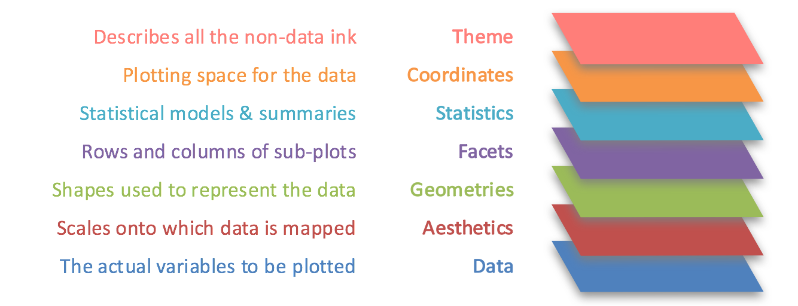
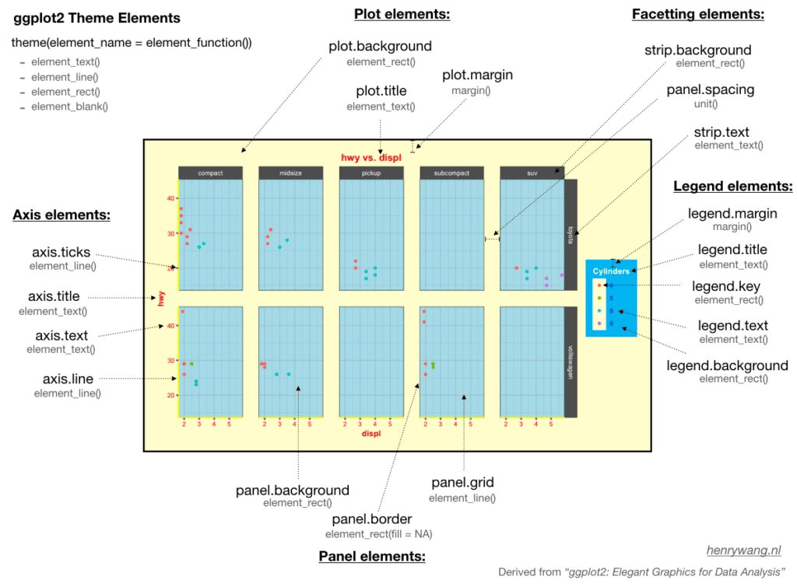

## Communicating better with visualisations {.smaller}

For a chart to stand alone, consider adding the following:

::: incremental
-   An eye-catching title, which explains the 'headline' of your chart.

-   A subtitle, with further explanation

-   A caption, which gives other relevant information, particularly the data source, or any necessary caveats to the data.

-   Relevant labels for the axes and legends

-   Annotations pointing out key findings.
:::

## Non data elements

```{r}
#| warning: false
#| message: false
#| echo: false
#| fig.height: 4
#| code-line-numbers: 18,19

library(tidyverse)
library(ggthemes)

options(scipen = 999999)

df = data.table::fread('box_office.csv')

df = df %>% 
  mutate(billions =total_inflation_adjusted_box_office/1000000000 )


ggplot() + 
  geom_point(data = df, aes(year, as.numeric(billions)), size= 1, alpha = .5) +
  geom_smooth(data = df, aes(year, as.numeric(billions)), method = "lm",
              formula = y ~ poly(x, 23), se = FALSE, color = 'black', alpha = .75) + 
  scale_y_continuous(limits = c(0, 15)) + 
  labs(title = 'Domestic Yearly Box Office, 1995 to 2023', 
       subtitle = "In billion US dollars, adjusted for inflation", 
       x = NULL, 
       y = "Box office in billions US (inflation adjusted)",
       caption = "Data from BoxOfficeMojo.com")  +
  geom_vline(xintercept=2020, color = 'red', alpha = .6, size = 2) +
  annotate("text", x=2019, y=5, label="First Pandemic Year", angle=90) + 
  theme_economist() + 
  theme(plot.caption = element_text(face = 'italic'))

```

## Titles

```{r}
#| code-line-numbers: "6,7,10"
#| echo: true
#| eval: false


ggplot() + 
  geom_point(data = df, aes(year, as.numeric(billions)), size= 1, alpha = .5) +
  geom_smooth(data = df, aes(year, as.numeric(billions)), method = "lm",
              formula = y ~ poly(x, 23), se = FALSE, color = 'black', alpha = .75) + 
  scale_y_continuous(limits = c(0, 15)) + 
  labs(title = 'Domestic Yearly Box Office, 1995 to 2023', 
       subtitle = "In billion US dollars, adjusted for inflation", 
       x = NULL, 
       y = "Box office in billions US (inflation adjusted)",
       caption = "Data from BoxOfficeMojo.com")  +
  geom_vline(xintercept=2020, color = 'red', alpha = .6, size = 2) +
  annotate("text", x=2019, y=5, label="First Pandemic Year", angle=90) + 
  theme_economist() + 
  theme(plot.caption = element_text(face = 'italic'))
```

## Labels

```{r}
#| code-line-numbers: "8,9"
#| echo: true
#| eval: false


ggplot() + 
  geom_point(data = df, aes(year, as.numeric(billions)), size= 1, alpha = .5) +
  geom_smooth(data = df, aes(year, as.numeric(billions)), method = "lm",
              formula = y ~ poly(x, 23), se = FALSE, color = 'black', alpha = .75) + 
  scale_y_continuous(limits = c(0, 15)) + 
  labs(title = 'Domestic Yearly Box Office, 1995 to 2023', 
       subtitle = "In billion US dollars, adjusted for inflation", 
       x = NULL, 
       y = "Box office in billions US (inflation adjusted)",
       caption = "Data from BoxOfficeMojo.com")  +
  geom_vline(xintercept=2020, color = 'red', alpha = .6, size = 2) +
  annotate("text", x=2019, y=5, label="First Pandemic Year", angle=90) + 
  theme_economist() + 
  theme(plot.caption = element_text(face = 'italic'))
```

## Annotation shapes

```{r}
#| code-line-numbers: "11"
#| echo: true
#| eval: false


ggplot() + 
  geom_point(data = df, aes(year, as.numeric(billions)), size= 1, alpha = .5) +
  geom_smooth(data = df, aes(year, as.numeric(billions)), method = "lm",
              formula = y ~ poly(x, 23), se = FALSE, color = 'black', alpha = .75) + 
  scale_y_continuous(limits = c(0, 15)) + 
  labs(title = 'Domestic Yearly Box Office, 1995 to 2023', 
       subtitle = "In billion US dollars, adjusted for inflation", 
       x = NULL, 
       y = "Box office in billions US (inflation adjusted)",
       caption = "Data from BoxOfficeMojo.com")  +
  geom_vline(xintercept=2020, color = 'red', alpha = .6, size = 2) +
  annotate("text", x=2019, y=5, label="First Pandemic Year", angle=90) + 
  theme_economist() + 
  theme(plot.caption = element_text(face = 'italic'))
```

## Labels

```{r}
#| code-line-numbers: "12"
#| echo: true
#| eval: false


ggplot() + 
  geom_point(data = df, aes(year, as.numeric(billions)), size= 1, alpha = .5) +
  geom_smooth(data = df, aes(year, as.numeric(billions)), method = "lm",
              formula = y ~ poly(x, 23), se = FALSE, color = 'black', alpha = .75) + 
  scale_y_continuous(limits = c(0, 15)) + 
  labs(title = 'Domestic Yearly Box Office, 1995 to 2023', 
       subtitle = "In billion US dollars, adjusted for inflation", 
       x = NULL, 
       y = "Box office in billions US (inflation adjusted)",
       caption = "Data from BoxOfficeMojo.com")  +
  geom_vline(xintercept=2020, color = 'red', alpha = .6, size = 2) +
  annotate("text", x=2019, y=5, label="First Pandemic Year", angle=90) + 
  theme_economist() + 
  theme(plot.caption = element_text(face = 'italic'))
```

## Preset theme

```{r}
#| code-line-numbers: "13"
#| echo: true
#| eval: false


ggplot() + 
  geom_point(data = df, aes(year, as.numeric(billions)), size= 1, alpha = .5) +
  geom_smooth(data = df, aes(year, as.numeric(billions)), method = "lm",
              formula = y ~ poly(x, 23), se = FALSE, color = 'black', alpha = .75) + 
  scale_y_continuous(limits = c(0, 15)) + 
  labs(title = 'Domestic Yearly Box Office, 1995 to 2023', 
       subtitle = "In billion US dollars, adjusted for inflation", 
       x = NULL, 
       y = "Box office in billions US (inflation adjusted)",
       caption = "Data from BoxOfficeMojo.com")  +
  geom_vline(xintercept=2020, color = 'red', alpha = .6, size = 2) +
  annotate("text", x=2019, y=5, label="First Pandemic Year", angle=90) + 
  theme_economist() + 
  theme(plot.caption = element_text(face = 'italic'))
```

## Customise theme elements

```{r}
#| code-line-numbers: "14"
#| echo: true
#| eval: false


ggplot() + 
  geom_point(data = df, aes(year, as.numeric(billions)), size= 1, alpha = .5) +
  geom_smooth(data = df, aes(year, as.numeric(billions)), method = "lm",
              formula = y ~ poly(x, 23), se = FALSE, color = 'black', alpha = .75) + 
  scale_y_continuous(limits = c(0, 15)) + 
  labs(title = 'Domestic Yearly Box Office, 1995 to 2023', 
       subtitle = "In billion US dollars, adjusted for inflation", 
       x = NULL, 
       y = "Box office in billions US (inflation adjusted)",
       caption = "Data from BoxOfficeMojo.com")  +
  geom_vline(xintercept=2020, color = 'red', alpha = .6, size = 2) +
  annotate("text", x=2019, y=5, label="First Pandemic Year", angle=90) + 
  theme_economist() + 
  theme(plot.caption = element_text(face = 'italic'))
```

## Adding labels with the labs() function {.smaller}

-   add the function `labs()` as a new layer to your plot using `+`
-   within `labs()`, you can specify a large number of elements, including **title**, **subtitle**, and **caption**. 

## Adding labels with the labs() function {.smaller}

```{webr-r}
#| context: setup
library(readr)
library(ggplot2)
library(dplyr)
library(tidyr)

url <- "https://raw.githubusercontent.com/jennybc/gapminder/refs/heads/main/data-raw/04_gap-merged.tsv"
download.file(url, "gapminder_df.csv")

gapminder_df =  read_tsv('gapminder_df.csv') |> filter(continent!= 'FSU')

df <- gapminder_df |>
  filter(year == 2007) |>
  mutate(pop_millions = pop/1000000)


```

## Titles, subtitles, and captions. {.smaller}

To add a `title`, `subtitle`, or `caption`, add within the `labs()` parenthesis, followed by the text you wish to add in quotation marks.

```{webr-r}

df |> 
  ggplot(aes(x = lifeExp, y =gdpPercap,size = pop_millions, color = continent))  + 
  geom_point() + 
  labs(title = "GDP and Life\nExpectancy")

```

## Try it yourself: {.smaller}

Add a subtitle with the year (2007) and a caption specifying the source of the data: https://www.gapminder.org/data/.

```{webr-r}
df |> 
  ggplot(aes(x = lifeExp, y =gdpPercap,size = pop_millions, color = continent))  + 
  geom_point() + 
  labs(title = "GDP and Life\nExpectancy")
```

## Labelling aesthetics {.smaller}

-   When you specify an aesthetic, such as `x`/`y`, `color` and so forth, ggplot2 automatically creates a scale, which is visualised by either an axis or a legend.

-   Ggplot takes the axis and legend labels directly from the column names. `labs()` allows you to override these labels. Simply specify the aesthetic and the new label.

## Labelling aesthetics {.smaller}

What aesthetics are specified in this chart?

```{webr-r}

df |> 
  ggplot(aes(x = lifeExp, y = gdpPercap, size = pop_millions, color = continent))  + 
  geom_point()

```

## Labelling aesthetics {.smaller}

```{webr-r}

df |> 
  ggplot(aes(x = lifeExp, y =gdpPercap, size = pop_millions, color = continent))  + 
  geom_point() + 
  labs(title = "GDP and Life\nExpectancy",
       x = "Life Expectancy")

```

## Try it yourself: {.smaller}

Copy the plot above and change the y axis to "GDP per Capita", and the size legend to "Population in Millions". Put part of the size legend label on a new line.

```{webr-r}
df |> 
  ggplot(aes(x = lifeExp, y =gdpPercap, size = pop_millions, color = continent))  + 
  geom_point() + 
  labs(title = "GDP and Life\nExpectancy",
       x = "Life Expectancy")
```

## Removing a legend {.smaller}

You can change the label for any aesthetic you specify in your chart. You can also remove a label completely by setting it to NULL, e.g.

```{webr-r}

df |> 
  ggplot(aes(x = lifeExp, y =gdpPercap, size = pop_millions, color = continent))  + 
  geom_point() + 
  labs(title = "GDP and Life\nExpectancy",
       x = NULL)

```

## geom_text {.smaller}

```{webr-r}


df |> 
  ggplot(aes(x = lifeExp, y =gdpPercap, size = pop_millions, color = continent))  + 
  geom_point() + 
  geom_text(data = df, aes(label = country), size = 4) + 
  labs(title = "GDP and Life\nExpectancy",
       x = NULL)

```

## geom_text {.smaller}

```{webr-r}

df_text = df %>% filter(country %in% c('Ireland', 'Netherlands'))

df |> 
  ggplot(aes(x = lifeExp, y =gdpPercap, size = pop_millions, color = continent))  + 
  geom_point() + 
  geom_text(data = df_text, aes(label = country), size = 4) + 
  labs(title = "GDP and Life\nExpectancy",
       x = NULL)

```

## Try it yourself:

Add a text layer with two countries of your choice:

```{webr-r}
df_text = 

df |> 
  ggplot(aes(x = lifeExp, y =gdpPercap, size = pop_millions, color = continent))  + 
  geom_point()
```

## Working with text. {.smaller}

The function `paste()` allows us to paste together text from several columns. For example, we could make a new column containing the country and GDP:

```{webr-r}

df_text = df |>
  filter(country %in% c('Ireland', 'Iceland')) |> 
  mutate(country_gdp = paste(country, " (", round(gdpPercap), ")", sep = ''))

df |> 
  ggplot(aes(x = lifeExp, y =gdpPercap, size = pop_millions, color = continent))  + 
  geom_point() + 
  geom_text(data = df_text, aes(label = country_gdp), size = 4, color = 'black')

```

# Themes

## Grammar of Graphics

{width="500"}

## Non-data elements

{width="500"}

## Two parts to adding themes:

-   Preset `theme_` functions
-   theme() layer

## Preset themes {.smaller}

-   Number of full themes which change the look and feel of all chart elements
-   Full list here: https://ggplot2.tidyverse.org/reference/ggtheme.html
-   Simply add as a layer, e.g `+ theme_light()`:

```{webr-r}
#| code-line-numbers: "8"


df <- gapminder_df |>
  filter(year == 2007) |>
  mutate(pop_millions = pop/1000000)

df |> 
  ggplot(aes(x = lifeExp, y =gdpPercap,size = pop_millions, color = continent))  + 
  geom_point()+ 
  theme_light()

```

## Extra-chart elements using theme() {.incremental}

-   Each visual part is an 'element'
-   Each element can be changed separately
-   Add `+theme()`
-   Specify the element
-   Specify the type
-   Change options within the type

## Example: changing the title font size. {.smaller}

```{webr-r}
#| code-line-numbers: "4"


df |> 
  ggplot(aes(x = lifeExp, y =gdpPercap,size = pop_millions, color = continent))  + 
  geom_point() +
  theme(axis.title.x = element_text(size = 16))

```

## Full list of element and types {.smaller}



## Exercises:

Copy and paste the chart above into a new cell. Make the following changes:

-   Change the panel background fill to `lightblue`.

-   Change the size of the title to 24, and the 'face' to bold.

-   Change the panel grid to the `linetype` 'dashed'.

## Exercises:

```{webr-r}
df |> 
  ggplot(aes(x = lifeExp, y =gdpPercap,size = pop_millions, color = continent))  + 
  geom_point() +
  theme(axis.title.x = element_text(size = 16))

```

# Annotations and Highlights

## Adding annotations using annotate() {.smaller}

Use the layer `annotate()`.

-   Annotate allows you to add geoms directly to your plot

-   instead of taking positions from your data, you specify them directly.

-   Specify the name of the geom (a short version, so geom_rect becomes simply rect).

-   Directly specify the position coordinates and any other aesthetics.

-   The most useful geom types here are the graphical 'primitives', such as `rect`, `polygon`, and `segment`, as well as `text`.

## Text {.smaller}

You can use annotate() to manually add informative labels to your charts.

```{webr-r}

df <- gapminder_df |>
  filter(year == 2007) |>
  mutate(pop_millions = pop/1000000)|>
  filter(continent == 'Europe')

df |> 
  ggplot(aes(x = lifeExp, y =gdpPercap, size = pop_millions))  + 
  geom_point() + 
  scale_size_area()
```

## Adding a text annotation

-   Put a text annotation somewhere in the large empty space of the chart.
-   The line intersecting about 73 on the x axis and 45000 on the y axis would be a good place to put the text.
-   Specify the label aesthetic

## Adding a text annotation

```{webr-r}
df |> 
  ggplot(aes(x = lifeExp, y =gdpPercap, size = pop_millions, color = continent))  + 
  geom_point() + 
  annotate(geom = 'text', x = 76, y = 45000, label = "Netherlands")
```

## Add a line

-   Use geom_curve to add a curved line with an arrow running from just underneath the text to the middle of the point.
-   Look at the data and find the relevant variables to use as a starting point.
-   The lifeExp (our x axis) for Netherlands is 79.762 and dfpPercap (y axis) is 36797.

## Add a line

```{webr-r}
df |> 
  ggplot(aes(x = lifeExp, y =gdpPercap, size = pop_millions, color = continent))  + 
  geom_point() + 
  annotate(geom = 'text', x = 76, y = 45000, label = "Netherlands") +  
  annotate(geom = 'curve', x = 76, y = 44000, xend = 79.76, yend = 36797)

```

## Drawing an arrow() {.smaller}

-   Finally we can specify an arrow with a special arrow() function.
-   Specify an arrow type, for instance 'closed' and a length.
-   The length is not a simple number but a 'unit' object, where we need to put the value within the function unit() and specify a unit, such as 'mm'.
-   You can also specify the arrow `angle` as a number between 0 and 90.

## Drawing an arrow()

```{webr-r}

df |> 
  ggplot(aes(x = lifeExp, y =gdpPercap, size = pop_millions, color = continent))  + 
  geom_point() + 
  annotate(geom = 'text', x = 76, y = 45000, label = "Netherlands") +  
  annotate(geom = 'curve', x = 76, y = 44000, xend = 79.76, yend = 36797, 
           arrow = arrow(type = 'closed', length = unit(2, 'mm')))

```

## Try it yourself

-   Add a label, line, and arrow pointing to the United States.

```{webr-r}
 df |> 
  ggplot(aes(x = lifeExp, y =gdpPercap, size = pop_millions, color = continent))  + 
  geom_point() 
```

## other geoms with annotate() {.smaller}

annotate() allows us to specify any of the geoms available, but besides `text`, the most useful ones are those which we didn't use for data visualisation directly: `segment`, `rectangle`, and `curve`. You can then specify the usual aesthetics of those geoms such as color, linetype, alpha and so forth.

## Lines

-   Add a line to your plot using 'segment'.
-   For a vertical line set the x and xend to the desired value.
-   To draw the line the whole way across the plot set y to 0 and yend to Inf (infinite).

## Lines

```{webr-r}

gapminder_df |> 
  filter(country %in% c('Netherlands', 'France', 'Ireland', 'Germany', 'Spain')) |>
  ggplot(aes(x = year, y =gdpPercap, color = country))  + 
  geom_line() + 
  annotate(geom = 'segment', x = 1982, xend = 1982, y = 0, yend = Inf, linetype = 'dashed')
```

## Rectangles {.smaller}

```{webr-r}
gapminder_df |> 
  filter(country %in% c('Netherlands', 'France', 'Ireland', 'Germany', 'Spain')) |>
  ggplot(aes(x = year, y =gdpPercap, color = country))  + 
  geom_line() + 
  annotate(geom = 'rect', xmin = 1960, xmax = 1980, ymin = 0, ymax = Inf, alpha = .5, linetype = 'dashed', color = 'black')
```

## Try it yourself:

Create an annotated area which highlights the early nineties recession between 1990 and 1993. Draw a label and an arrow for it. Set a fill color, alpha and one other aesthetic value.

```{webr-r}
gapminder_df |> 
  filter(country %in% c('Netherlands', 'France', 'Ireland', 'Germany', 'Spain')) |>
  ggplot(aes(x = year, y =gdpPercap, color = country))  + 
  geom_line() 
```

## Highlighting using color {.smaller}

1.  Start with your basic chart. Perhaps change colors or transparency to make the majority of the data 'fade' into the background.

2.  Next create new datasets containing only the data you wish to highlight.

3.  Add these as layers to your existing chart

4.  Change the colors of these new elements

## Highlighting using color {.smaller}

```{webr-r}

df_highlight = df %>% filter(country %in% c('Ireland', "Netherlands", "France"))

df |> 
  ggplot(aes(x = lifeExp, y =gdpPercap, size = pop_millions))  + 
  geom_point(color = 'gray50', alpha = .8) + 
  geom_point(data = df_highlight, color = 'red') 

```
