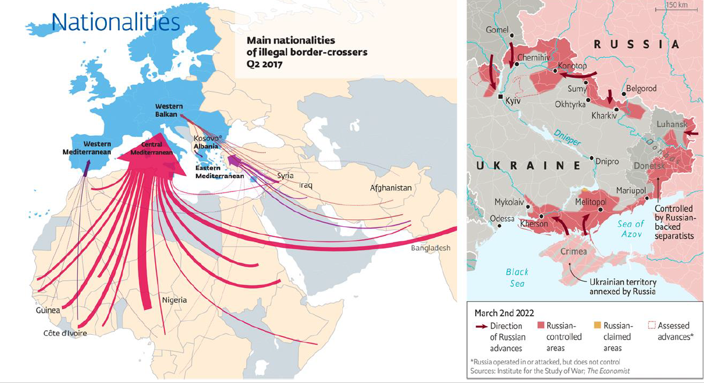
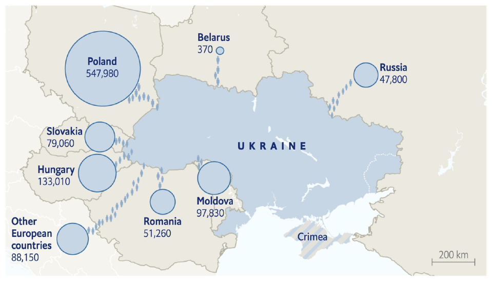
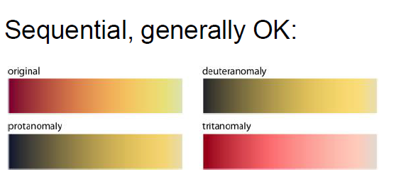
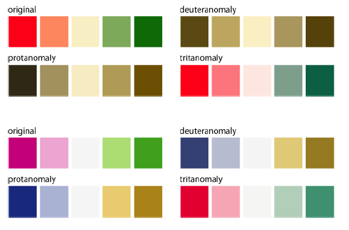
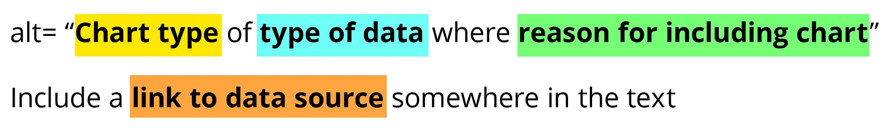
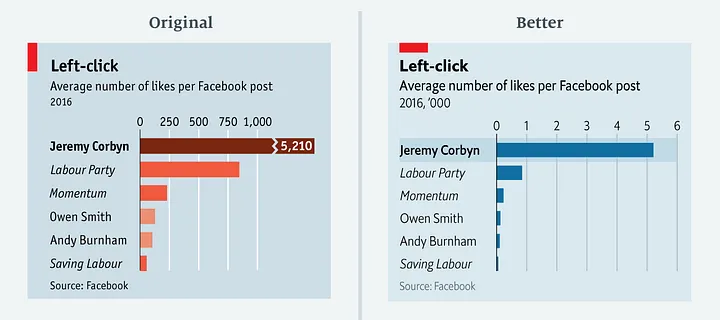
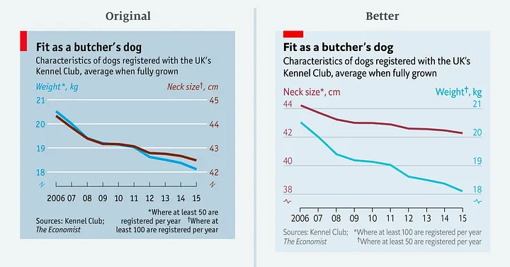
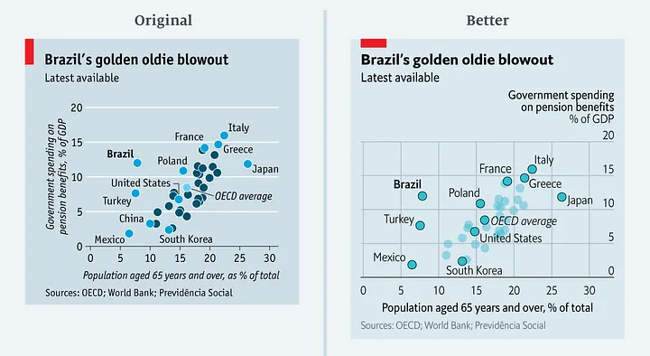
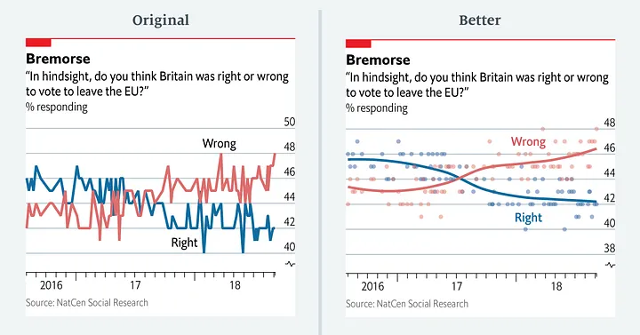

```{webr-r}
#| context:setup

library(tidyverse) 
library(palmerpenguins)  

penguins = palmerpenguins::penguins  

```

## Responsible Data Visualisation

-   Reproducible
-   Ethical
-   Accessible

## Reproducible

-   An important concept in the sciences
-   Others should be able to reproduce the same results with the same data and methods
-   In practice, this means re-sharing the code and datasets used to make data visualisation

## Reproducible

-   Using our methods this is almost automatic - I (or anyone else) can reproduce your work from your code.
-   Make sure you include any datasets you use in your projects
-   If they can't be shared directly, provide a link, to a specific version if applicable
-   Explain any steps or manipulation done to the data

## Ethical

-   Ethics in data visualization could be thought of as fairly **representing through data and design**.

-   Both by:

-   representing data correctly (not being misleading),

-   not making implicit judgements with design.

## Falsifying data

One obviously unethical way to make data visualisations is by directly falsifying data.

Could be on purpose or by omission: - Adding or removing your own data points before visualisation - Filtering the dataset to better suit a narrative.

## Judgements and bias

Avoid introducing conscious or unconscious bias into our design choices.

Color and shape are particularly important

e.g.'menacing red arrows' to depict refugee and asylum seeker flows.

## Judgements and bias

This visual language is very reminiscent of the way in which we depict invading armies.



## Judgements and bias

There are many ways around this, for example using colors with more neutral associations, and, as in a graphic by the Economist a few years back, by replacing arrows with icons of people.



Colours:

## **What does it mean to make our content accessible?**

When making visualizations it is important to take into account accessibility. In this context, **accessibility means making the content more readable and understandable by everyone.**

## **What does it mean to make our content accessible?**

We should remember that those viewing our content, particularly if it is placed online may have issues with:

-   Sight

-   Colour perception

-   Motor skills

## Some key ways in which we make visualisations *less* accessible include:

-   Prioritising the visual experience without consideration for people navigating via screen reader.

-   Color schemes that are not accessible to people who are color blind or have low vision

-   Interactive elements that are not reachable for people navigating via keyboard.

## Web Content Accessibility Guidelines (WCAG) 2.2:

-   Parts of graphics required to understand the content have a contrast ratio of at least 3 to 1 against adjacent colours. Except when a particular presentation of graphics is essential to the information being conveyed

-   Colour is not used as the only visual means of conveying information, indicating an action, prompting a response or distinguishing a visual element

-   E.g. Avoid using legends in line charts and pie charts. Instead, label the lines and sectors on the chart.

## Color-blindness

-   Color blindness (or color vision deficiency, CVD) is the decreased ability to see color or differences in color, specifically hue.

-   The most common is less distinction on red-green (deuteranomaly or protanomaly) or blue-yellow (tritanomaly) axis. Red green affects about 8% of males and 0.05% of females.

-   The three key scales, as you'll remember, are **sequential** (for continuous data), **categorical** (for text or categories), and **diverging** (which are sequential, but with a 'midpoint'. These are affected in different ways.

## Sequential color scales

-   **Sequential color scales** are affected the least, because they are generally made up of a single hue.

{width="400"}

## Sequential color scales

-   The 'Viridis' scale is generally better for distinguishing low and high values.

-   To make these changes in our code, we'll need to use the `scale_colour_` functions. For instance, to specify the gradient colors for a scatter plot, use `scale_color_gradient()`.

## Try it yourself:

Edit the plot below to use either the 'Viridis' continuous scale, or a gradient with two colours of your choice.

```{webr-r}

ggplot(data = penguins, aes(x = bill_length_mm, y = flipper_length_mm, color = body_mass_g)) +    
  geom_point(size = 3)  

```

## Diverging color scale

-   A special type of gradient is a 'diverging' color palette, where third color is used as a midpoint.

-   Red-green diverging, in particular, should be replaced with another color scale.

{width="450"}

## Categorical color scales

-   Finally, categorical color schemes (where the data is unordered, usually for categories or text),
-   use a palette of distinct colors specifically chosen to be safe for color vision deficiency.
-   You can find a set of built-in palettes on the [ColorBrewer website](https://colorbrewer2.org/).

## Try it yourself:

Choose a palette or manual colors from the choices above.

(`scale_color_distiller` chooses categorical colours from a palette).

```{webr-r}

ggplot(data = penguins, aes(x = bill_length_mm, y = flipper_length_mm, color = species)) +    
  geom_point(size = 3) 

```

## Contrast

-   Contrast can be defined as the difference in perceived luminance between two colors.

-   Higher contrasts are easier to perceive for everybody, particularly those with sight impairments.

-   For example, in comparison to a white background (the most commonly-used colour):

-   Pure red has a ratio of 4:1

-   Pure green has a ratio of 1.4:1 (very low)

-   Pure blue has a ratio of 8.6:1 (quite high).

## Contrast

```{webr-r}

ggplot(data = penguins, aes(x = bill_length_mm, y = flipper_length_mm, color = species)) +    
  geom_point(size = 3) + 
  theme_bw() +
  scale_color_manual(values = c('red', 'green', 'blue'))

```

## Web Content Accessibility Guidelines (WCAG) 2.2:

-   All non-text content that is presented to the user has a text alternative that serves the equivalent purpose.

-   The visual presentation of text and images of text has a contrast ratio of at least 4.5 to 1

-   Instructions provided for understanding and operating content do not rely solely on sensory characteristics of components such as shape, colour, size, visual location, orientation, or sound.

## Making non-data elements accessible (themes)

-   Make the font as large as is suitable for the image

-   Use a sans serif font

-   Use a black or dark grey text for annotations and labels of lines or segments

## Making non-data elements accessible (themes)

-   Use a lighter grey for axes labels so the important information stands out

-   Only use coloured text when it is essential -- if you are using coloured text use a contrast checker to make sure your text meets the contrast requirements against the background

## Alt-text

**Alt Text defined [from Webaim](https://webaim.org/techniques/alttext/):**

> It is read by screen readers in place of images allowing the **content** and **function** of the image to be accessible to those with visual or certain cognitive disabilities.
>
> It is displayed in place of the image in browsers if the image file is not loaded or when the user has chosen not to view images.
>
> It provides a semantic meaning and description to images which can be read by search engines or be used to later determine the content of the image from page context alone.

## The following is a good template to use for writing alt-text:

{width="500"}

## **Chart type**

It's helpful for people with partial sight to know what chart type it is and gives context for understanding the rest of the visual.\
*Example: Line graph*

## **Type of data**

What data is included in the chart? The x and y axis labels may help you figure this out.\
*Example: number of bananas sold per day in the last year*

## **Reason for including the chart**

Think about **why** you're including this visual. What does it show that's meaningful. There should be a point to every visual and you should tell people what to look for.\
*Example: the winter months have more banana sales*

## **Link to data or source**

Don't include this in your alt text, but it should be included somewhere in the surrounding text. People should be able to click on a link to view the source data or dig further into the visual. This provides transparency about your source and lets people explore the data.\
*Example: Data from the [USDA](https://data.ers.usda.gov/reports.aspx?ID=17850)*

## Adding alt-text in R Markdown.

## Mistake: Truncating the scale



## Forcing a relationship by cherry-picking scales



##  Confusing use of colour



## Choosing the wrong visualisation method


