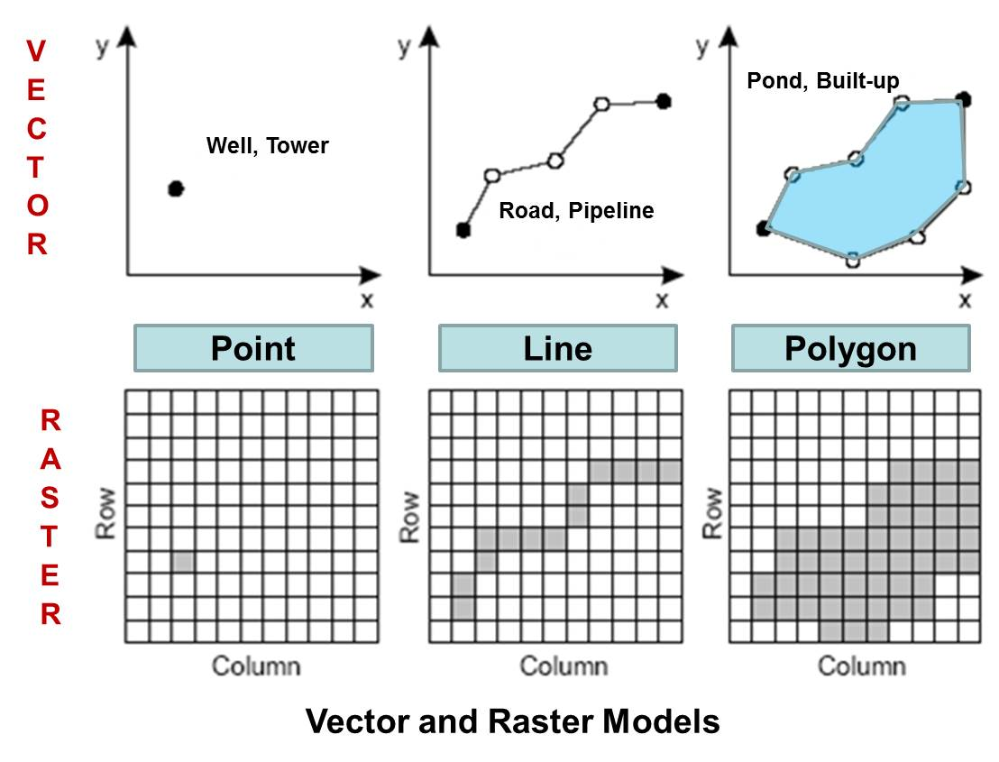
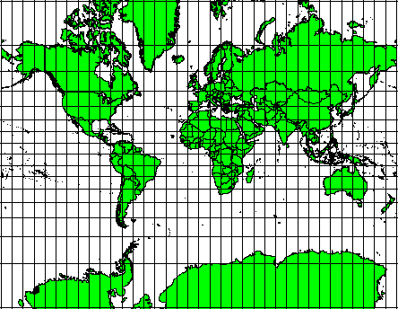
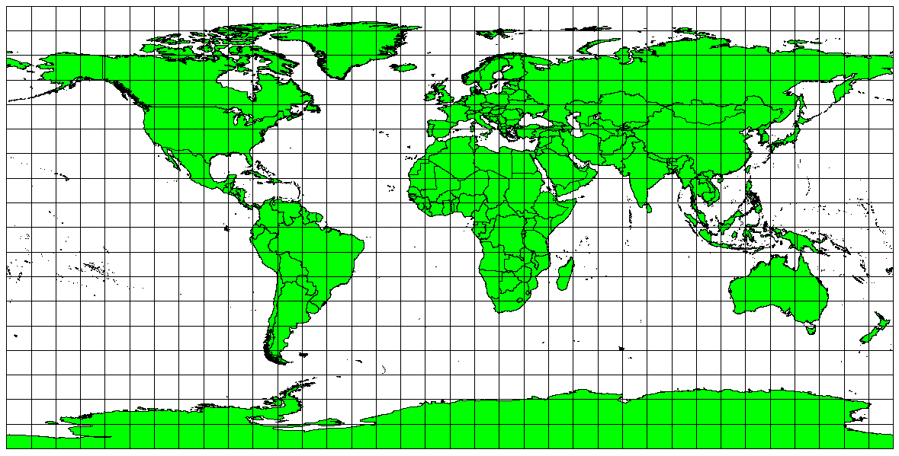

```{webr-r}
#| context: setup
library(rnaturalearthdata)
library(tidyverse)
library(rnaturalearth)
library(sf)


```

## What is digital mapping?

-   representations of geographic or spatial information
-   Data maps: mapping geographic features to external data

## Not just digital maps..

-   Gazetteers
-   Digitisation and analysis of old maps

## Not just digital maps..


## Not just digital maps..


## Creating Digital Maps

::: columns
::: {.column width="30%"}
-   Two main types:
    -   Raster maps
    -   Vector maps
:::

::: {.column width="70%"}
{fig-align="center"}
:::
:::

## Raster maps

::: columns
::: {.column width="40%"}
-   Grid of pixels
-   Each represents something about that point such as terrain, roads, weather, elevation..
:::

::: {.column width="60%"}
{fig-align="center" width="360"}
:::
:::

## Vector maps

::: columns
::: {.column width="40%"}
-   Geographic features represented as series of numerical values.
-   Usually points, lines, and polygons
:::

::: {.column width="60%"}

:::
:::

## Mapping also involves mapping aesthetics to values

-   Key difference is that position is generally based on geographic position
-   Otherwise we can map as usual: color, fill, transparency, etc.

## Making maps programmatically

-   We'll use the following 'stack':
-   'sf' package for reading and processing geographic data
-   'Tidyverse' for filtering, summarising etc.
-   'ggplot2' for visualising
-   Optionally, 'tmap' for fancier visual maps.

## Shapefiles

::: columns
::: {.column width="40%"}
-   Shapefiles store geographic vector features
-   This could be polygons outlining the shape of the coastline, or it could be detailed internal borders of countries, regions, or municipalities.
:::

::: {.column width="60%"}
{width="600"}
:::
:::

## Where do we get shapefiles?

-   Mapping packages such as rnaturalearth
-   Official government sources, such as Ordnance Survey UK
-   Other sources, for example historical GIS.

## Simple features and the sf package

-   The sf package is widely used as a modern way to read and process geographic data
-   sf stands for 'simple features', the name of the format it works with
-   A simple features object in R looks like a dataframe, with one row per 'feature'
-   It has an additional 'geometry' column which stores the shape of that feature
-   Can also contain further data

## Getting simple features objects using RNaturalEarth

-   Package for R which connects to the Natural Earth database
-   Allows you to download simple features objects to process and map in R
-   Fairly limited to world-scale objects: includes country borders, coastlines, rivers, lakes.
-   For some countries (e.g. USA) has more detailed information

## Country borders

To download a shapefile of country borders, use the function `ne_countries()`. Remember to save this as an object in your environment using `<-`. As well as the function itself you'll need to specify some further parameters:

-   `scale =` , which will determine how detailed the borders should be, one of `small`, `medium`, or `large`.

-   `returnclass =`, which will specify the type of data to be downloaded from the database. In all cases, we'll use `returnclass = 'sf'` (note the quotation marks around sf). This returns the file in the format we want to work with, **simple features**.

-   Optionally, you can specify that the function return a single country or list of countries. This is done using the syntax `country = 'Netherlands'` or `country = c('Netherlands', 'Spain')`.

## Country borders

The following code will download a dataset in sf format, of all world countries:

```{webr-r}
worldmap = ne_countries(scale = 'medium', returnclass = 'sf')
```

## Try it yourself:

Download a small scale shapefile containing Germany, Netherlands, France, Belgium, and Luxembourg. Don't forget to assign it as an object using `<-`.

```{webr-r}

```

## Downloading coastlines

This code downloads a simple map of the world's coastlines, useful if you want a map without any political borders. This is done with the function `ne_coastline`. In this case, we should specify the `scale` and `returnclass`:

```{webr-r}

worldcoastlines = ne_coastline(scale = 'medium', returnclass = 'sf')

```

## Downloading other data

-   There are many other datasets but you need to contruct the query yourself using `ne_download()`.

In order to work with this function, you need to know how the Natural Earth database stores data. Each file is one of three categories:

-   cultural: meaning 'human-created' geographic objects such as country borders, cities, and so forth.
-   physical: physical features such as rivers, lakes, mountains.
-   raster: geographic data made from pixels instead of shapes. We won't work with this on this course.

## Downloading other data

Next, the data is at one of three scales: - small - medium - large.

On the Natural Earth data download page, you'll see that there are links to each of these categories at each different scale.

## Construct a query

-   Within the ne_download() function, specify the correct `scale` from small, medium large. Next choose the `category`, from cultural, physical or raster.

-   Specify the `type`.

-   For this, take the saved download link, and take everything after the ne\_ and the scale, (in this case `ne_10m_`, and before the .zip. In this example this is simply `populated_places`.\*\*

-   Finally, set the `returnclass` argument to `"sf"` as before.

```{webr-r}

populated_places = ne_download(scale = 'medium', type = 'populated_places', category = 'cultural', returnclass = 'sf')

```

## Try it yourself:

Download a medium-scale set of rivers - browse to the right section [here](https://www.naturalearthdata.com/downloads/) and find the relevant filename.

```{webr-r}

```

## Try it yourself:

Download a large-scale set of Admin 1, states and provinces.

```{webr-r}

```

## The sf package and tidyverse

-   Each feature is stored as a row in a regular dataframe
-   This means we can filter, join, summarise
-   We can also do special spatial operations which we'll learn next week

## An sf object

```{webr-r}
glimpse(worldmap)

```

## Try it yourself:

filter the `worldmap` object to include just the continent Europe.

```{webr-r}

```

## Try it yourself:

Create a geographic object of countries with a population of less than 5 million (the `pop_est` column):

```{webr-r}

```

## Visualising with ggplot

-   Very similar to the regular visualisation workflow
-   use `geom_sf()` instead of `geom_col()`, `geom_point()` etc
-   Don't specify x and y positions

## Basic map from an sf object

```{webr-r}

ggplot() +
  geom_sf(data = worldmap) 

```

## Use `aes()` to map variables in the data to aesthetics.

```{webr-r}

ggplot() +
  geom_sf(data = worldmap, aes(fill = pop_est)) 


```

## Change themes

-   `theme_void()` often useful

```{webr-r}

ggplot() +
  geom_sf(data = worldmap, aes(fill = pop_est)) + 
  theme_void()


```

## Adjusting other layers.

Just as with regular ggplot charts, you can adjust the scales, themes, and even add facets.

## Try it yourself:

-   Remove the continent 'Antarctica'.

-   Filter out any negative GDP values.

-   Calculate the GDP per capita in a new column (the population column is `pop_est` and the total GDP column is `gdp_md`).

-   Visualise the GDP per capita as the fill colour, with a gradient scale running from yellow to red.

-   Move the legend to the bottom of the chart and increase the width to fill the horizontal space.

-   Give the legend a better title.

```{webr-r}


```

## Coordinates layer

-   Useful in mapping as we'll often want to limit a full map
-   Change using `coord_sf()`

```{webr-r}

ggplot() +
  geom_sf(data = worldmap, aes(fill = pop_est)) + 
  coord_sf(xlim = c(-10, 10), ylim= c(48, 60)) 

```

## Try it yourself:

-   Add a coordinate layer to restrict the worldmap to roughly Australia

## Issues with data maps

```{webr-r}

ggplot() +
  geom_sf(data = worldmap, aes(fill = pop_est)) + 
  coord_sf(xlim = c(-10, 10), ylim= c(48, 60)) 

```

## Filter instead?

```{webr-r}

small_map = worldmap |> 
  filter(name %in% c('United Kingdom', 'Netherlands', 'Ireland', 'France', 'Belgium', 'Luxembourg', 'Denmark', 'Germany'))

ggplot() +
  geom_sf(data = small_map, aes(fill = pop_est))
```

## Both better

```{webr-r}

ggplot() +
  geom_sf(data = small_map, aes(fill = pop_est)) + 
  coord_sf(xlim = c(-10, 10), ylim= c(48, 60)) 

```

## Exercises

-   Use the worldmap data to map the economic category (`income_grp`) of the South American continent to the fill of the polygon shapes.
-   Adjust the limits of the coordinates to remove the empty space to the west.
-   Set the colour of the borders to 'black'.
-   Add a suitable title and subtitle, and legend title.
-   Change the fill scale of the visualisation (use three manual colors) and the 'void' theme.

```{webr-r}


```

## Coordinate Reference System and Projections

-   **Map projections** try to portray the surface of the earth, or a portion of the earth, on a flat piece of paper or computer screen. In layman's term, map projections try to transform the earth from its spherical shape (3D) to a planar shape (2D).

-   A **coordinate reference system (CRS)** then defines how the two-dimensional, projected map in your GIS relates to real places on the earth. The decision of which map projection and CRS to use depends on the regional extent of the area you want to work in, on the analysis you want to do, and often on the availability of data.


### Accuracy

-   Map projections are never absolutely accurate representations of the spherical earth.
-   As a result of the map projection process, every map shows distortions of angular conformity, distance and area.

#### Compromise

-   Used to draw a visual map of the world


#### Angular conformity

-   Used for navigation and meterology



#### Equal distance

-   Used for navigation, seismic mapping



#### Equal area

-   Useful for data mapping


### Coordinate Reference Systems

Every geographic map must specify its coordinate reference system, or CRS. A CRS allows every position on earth to be specified by a set of two or three numbers (the third number is altitude, which is generally ignored for the kinds of maps we're making). There are two types: **geographic** and **projected**.  

#### Geographic

A geographic CRS uses longitude and latitude to describe a location on earth's surface. The most popular is called WGS 84. It also has an EPSG code: 4326. The R Natural Earth world maps use this CRS, for example.


## Projected

-   Way of finding points based on a projected map rather than a globe
-   Universal Transverse Mercator (UTM) most popular
-   Globe is divided into zones - you need to know the zone along with the values
-   Values are northing and easting

## Projected


## What does it mean for us?

-   Merging or mapping multiple datasets must all be in the same CRS
-   Sometimes this means setting or transforming the existing CRS

You can transform a map from one CRS to another using st_transform(). The following will change the CRS to British National Grid: 

```{r, eval=FALSE}

worldmap <- worldmap |> 
  st_transform(crs = 27700)

```

## Changing projection

-   Done using `st_transform()`
-   Over 170 projections available in sf package
-   You can view them using `sf_proj_info()` in the console

## Changing projection

```{webr-r}

worldmap_moll <- worldmap |>
  st_transform(crs = "+proj=moll")

```

## Changing projection

```{webr-r}

ggplot(data = worldmap_moll, aes(fill = pop_est)) + 
  geom_sf()

```

## Try it yourself
