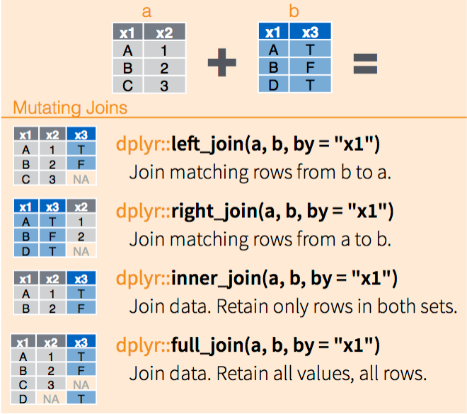

# Joins

```{webr-r}
#| context: setup

library(dplyr)
library(readr)
library(tidyr)
library(ggplot2)


url <- "https://raw.githubusercontent.com/yann-ryan/infovis-course/master/titanic_df_full.csv"
download.file(url, "titanic_df.csv")

titanic_df =  read_csv('titanic_df.csv')

locations_df = tribble(
  ~code, ~location_name, ~country,  ~lat, ~lng,
  "Q",   "Queenstown", "Ireland", 51.85, -8.29,
  "S",   "Southampton", "United Kingdom", 50.9, -1.4,
  "C",   "Cherbourg", "France", 49.63, -1.62
)

url <- "https://raw.githubusercontent.com/yann-ryan/infovis-course/master/gapminder_data.csv"
download.file(url, "gapminder.csv")

gapminder_df =  read_csv('gapminder.csv')

gapminder_population =  gapminder_df |> 
  filter(continent == 'Europe') |> 
  select(country, year, pop) |> 
  pivot_wider(names_from = year, values_from = pop)


```

## Join

-   Merging together datasets using a 'common key'
-   Often used to augment one dataset with further information
-   Example: we have an additional table containing further information the embarked places

## Join


```{webr-r}
titanic_df
```

## Join

```{webr-r}
locations_df
```

## Join types



## The join function

-   Needs a key: a common column to both datasets

```{webr-r}
titanic_df |>
  left_join(locations_df, by = c('embarked' = 'code'))
```

## The join function

{width="300"}

## Try it yourself

-   Calculate the number of men and women which embarked from each country,
-   First merge the new table with the existing one.

# Reshaping data


## Data terminology

-   **variables** can be thought of as the label of a fact, such as eye colour, hair colour, city of birth, and so forth.
-   **observations** are individual instances of that fact, usually a single thing recorded about something. For example, you could record my eye colour and the observation would be 'The eye colour of Yann Ryan is...'
-   **Values** are the actual measurements for that fact: in this case, the value for this observation would be blue.

## Wide and long data

Tabular datasets can usually be described in one of two formats: **wide** or **long**.

## Wide data

-   Wide datasets are where observations can be in columns. For example, if you had a dataset of a group of employment rates and the value for 2017 is in one column, the value for 2018 in the next, and so forth.


## Long data

-   Long datasets are where each observation is in a separate row, like this:


In this case, each individual fact (for example, 'the employment rate of Belgium in 2017') has a separate row.

## Why?

Recording data in this second method is desirable for data analysis (the first is more useful when looking at a table in a spreadsheet programme).

-   It's more consistent and easier to work with
-   It helps for applying our existing tools (joins, mutate, filter, etc)

## Tidy data

Tidy data is data where:

-   Each variable is in its own column.

-   Each observation is in its own row

-   Each value is in its own cell.

## Wide data

```{webr-r}

gapminder_population

```

## pivot_longer()

This takes a dataset and a specified set of columns, and reshapes them so that each of these columns now have their own row, repeating the information where needed.

## pivot_longer()

Arguments:

-   The dataset to use (or one passed from the pipe)
-   `cols` which lists the columns to reshape. The columns can be selected using the same methods as the `select()` function, meaning they can be selected by position, name, and so forth.
-   `names_to`: what you would like to call the column containing the new variable.
-   `values_to`: what you would like to call the new values.

## pivot_longer()

```{webr-r}

gapminder_population |>
  pivot_longer(cols = 2:13, names_to = 'year', values_to ='population')

```

## as_numeric()

If the column you're reshaping was numeric, such as a year, you'll often need to switch it back to a number using `as_numeric()`


```{webr-r}

gapminder_population |>
  pivot_longer(cols = 2:13, names_to = 'year', values_to ='population')|>
  mutate(year = as.numeric(year))

```

## pivot_longer()

```{webr-r}


gapminder_population |>
  pivot_longer(cols = 2:13, names_to = 'year', values_to ='population')|>
  mutate(year = as.numeric(year)) |>
  filter(country == 'Netherlands' & year == 2007)

```

## pivot_longer()

```{webr-r}


gapminder_population |>
  pivot_longer(cols = 2:13, names_to = 'year', values_to ='population')|>
  mutate(year = as.numeric(year)) |>
  ggplot() + 
  geom_col(aes(x = year, y = pop))

```