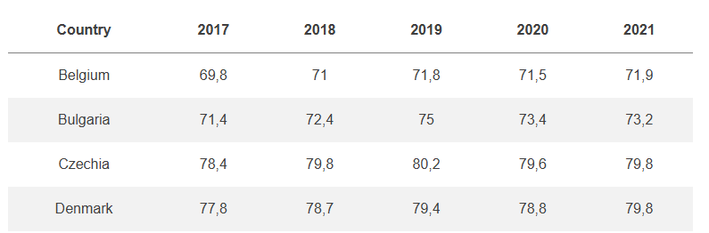
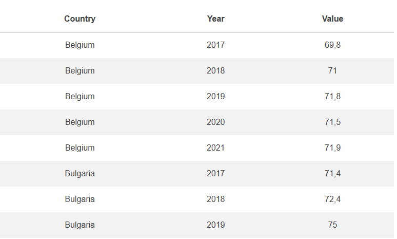

```{webr-r}
#| context: setup

library(dplyr)
library(readr)

url <- "https://vincentarelbundock.github.io/Rdatasets/csv/gapminder/gapminder.csv"
download.file(url, "gapminder.csv")

gapminder_df =  read_csv('gapminder.csv')

gapminder_population =  gapminder_df |> filter(continent == 'Europe') |> select(country, year, pop) |> pivot_wider(names_from = year, values_from = pop)


```

## Reshaping data

The final function we'll learn in this section on data science is called pivot_longer(). The use of this might seem a bit abstract at first, but I hope it is something you will find very useful in the long run, because it will allow you to apply your data wrangling skills to a much wider pool of datasets.

### Data terminology

To understand what it does, we need to back up a little bit. First of all, a bit of terminology about datasets:

-   **variables** can be thought of as the label of a fact, such as eye colour, hair colour, city of birth, and so forth.
-   **observations** are individual instances of that fact, usually a single thing recorded about something. For example, you could record my eye colour and the observation would be 'The eye colour of Yann Ryan is...'
-   **Values** are the actual measurements for that fact: in this case, the value for this observation would be blue.

### Wide and long data

Tabular datasets can usually be described in one of two formats: **wide** or **long**.

-   Wide datasets are where observations can be in columns. For example, if you had a dataset of a group of employment rates and the value for 2017 is in one column, the value for 2018 in the next, and so forth.



-   Long datasets are where each observation is in a separate row, like this:



In this case, each individual fact (for example, 'the employment rate of Belgium in 2017') has a separate row.

Recording data in this second method is desirable for data analysis (the first is more useful when looking at a table in a spreadsheet programme), as it makes it much easier to work with. Data in this format is also known as tidy. 

## Tidy data

Tidy data is data where:

-   Each variable is in its own column.

-   Each observation is in its own row

-   Each value is in its own cell.

As an example of a 'wide' dataset, there is a dataset called `gapminder_population` loaded into memory. View it by running the cell below:

```{webr-r}

gapminder_population

```

This dataset contains population records for countries in Europe. You can see that each country is a separate row, and each year is a separate column. This is not tidy data, because each year is actually a separate observation, and should in its own row. 

## pivot_longer()

To reshape this to the more useful format, we can use a new function called `pivot_longer()`. This takes a dataset and a specified set of columns, and reshapes them so that each of these columns now have their own row, repeating the information where needed. 

The function has a number of important arguments:

-   The dataset to use (or one passed from the pipe)
-   `cols` which lists the columns to reshape. The columns can be selected using the same methods as the `select()` function, meaning they can be selected by position, name, and so forth. 
-   `names_to`: what you would like to call the column containing the new variable. 
-   `values_to`: what you would like to call the new values. 

```{webr-r}

gapminder_population |>
  pivot_longer(cols = 2:13, names_to = 'year', values_to ='population')

```
See the shape of the data? It now contains far more rows, one for each observation (the population for a given country in a particular year). 


