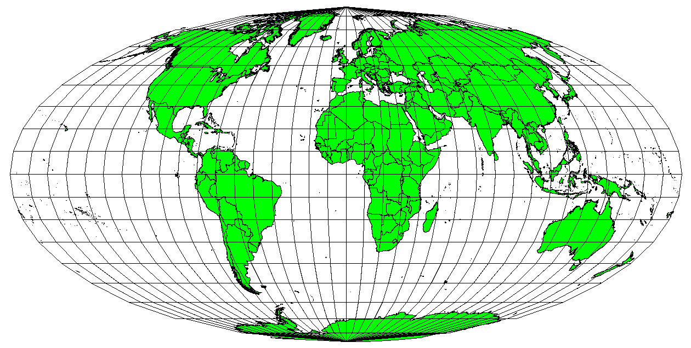
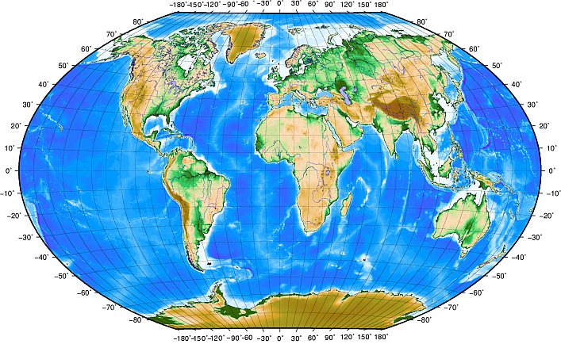
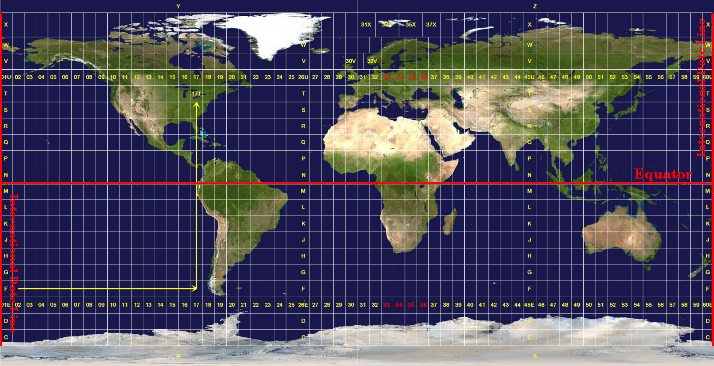

```{webr-r}
#| context: setup

library(tidyverse)
library(rnaturalearth)
library(sf)

sf_use_s2(FALSE)

worldmap = ne_countries(scale = 'medium', returnclass = 'sf')
```

## The sf package

On the last page we specified that rnaturalearth should download files in the 'sf' class. sf stands for Simple Features, and it is one of several formats of geographic data we could work with.

A simple features object is very similar to a dataframe. Each 'feature', usually meaning a point, a single polygon, or sometimes a line, is represented as one row in a dataframe. In the 'worldmap' example, we can see that each shape has other data variables, such as the continent, population, and so forth.

```{webr-r}
glimpse(worldmap)
```

This is useful because we can use regular tidyverse verbs on the geographic object, such as `filter()`, `mutate()`, `summarise()`, and `join()`. This means we can customise the geographic object before we map it.

::: callout-note
## Good to know

`join()` is particularly useful because in most real cases, we'll want to merge a geographic object with some external data. summarise() is also useful, but a bit more complicated, because it will summarise the geometry of the geographic object
:::

## Filtering a shapefile

If you run the code above to look at the object 'worldmap' in your environment (downloaded from R Natural Earth), you'll see it is a dataframe with a large number of columns, with one row for each country. If you go to the very last column, you'll see it has a 'geometry' column, where it stores the shapes for each country. But as well as this basic information on the shapes, the data contains continent and even some economic and demographic information. You can use the regular tidyverse functions on this dataframe.

For example, instead of downloading individual maps from the Natural Earth server, you can download a single world map and then use `filter()` to subset it for different purposes.

**Try it yourself:** filter the `worldmap` object to include just the continent Europe.

```{webr-r}

```

**Try it yourself:** Create a geographic object of countries with a population of less than 5 million (the `pop_est` column):

```{webr-r}

```

## Visualising with ggplot

Plotting and visualising these maps will also be done with a package you are familiar with: ggplot2.

To draw maps instead of regular data, it just requires some small changes. To draw a map we'll use a geometry layer starting with `geom_`, as we did with `geom_col`, `geom_point` and so forth.

The geom for maps is called `geom_sf()` and it works in the exact same way as the others, except it knows to treat the data as a map.

In earlier visualisations, we always had to specific the positions as x and y aesthetics. When we use `geom_sf` on a geographic object, the positions are taken directly from it.

Using `geom_sf` on its own on an `sf` object will take that object and plot it as a simple two-dimensional map. Following this, you can use the rest of the ggplot syntax you learned to modify the maps. For example, you can change the fill and color of the shapes using `fill =` and `color =`. With a points map, you can map `size`, `shape`, or `color` to elements of your data.

You can also use the same code as before to change the scales, add annotations, use themes, and set limits to the plot.

To create a basic map from an sf object called `worldmap` simply use ggplot() as before, but add + geom_sf() to your map:

```{webr-r}

ggplot() +
  geom_sf(data = worldmap) 


```

As with visualising regular dataframes, use `aes()` to map variables in the data to aesthetics.

```{webr-r}

ggplot() +
  geom_sf(data = worldmap, aes(fill = pop_est)) 


```

Or change themes. With maps, in most cases you'll want to change or remove the extra plot elements. One simple way to do this is with `theme_void()`.

```{webr-r}

ggplot() +
  geom_sf(data = worldmap, aes(fill = pop_est)) + 
  theme_void()


```

## Adjusting other layers.

Just as with regular ggplot charts, you can adjust the scales, themes, and even add facets.

**Try it yourself:**

-   Remove the continent 'Antarctica'.

-   Filter out any negative GDP values.

-   Calculate the GDP per capita in a new column (the population column is `pop_est` and the total GDP column is `gdp_md`).

-   Visualise the GDP per capita as the fill colour, with a gradient scale running from yellow to red.

-   Move the legend to the bottom of the chart and increase the width to fill the horizontal space.

-   Give the legend a better title.

```{webr-r}


```

## Add titles and labels:

## Coordinates layer

One layer we skipped over in ggplot is the coordinates layer. This is because in most cases we don't want to change it. It is more useful to adjust the coordinates when mapping. Particularly setting limits to zoom in on a particular area of the map. We can make adjustments by specifying the coordinate layer using `coord_sf()`. Next, you can set the xlim and ylim arguments:

```{webr-r}

ggplot() +
  geom_sf(data = worldmap, aes(fill = pop_est)) + 
  coord_sf(xlim = c(-10, 10), ylim= c(48, 60)) 

```

**Try it yourself:**

## Working with data maps

Creating maps is a little less exact than making regular visualisations. In most cases, you'll want to filter the data before hand, as well as limit the coordinates. Here is what happens if we only do one or the other.

Setting the coordinate limits doesn't change the data before visualisation. This means that the color scale will be based on the entire map rather than the section used. If the data is mapped to something like population, this might mean that the map colors don't represent the full range of the data on the visible map, as here:

```{webr-r}

ggplot() +
  geom_sf(data = worldmap, aes(fill = pop_est)) + 
  coord_sf(xlim = c(-10, 10), ylim= c(48, 60)) 

```

On the other hand, only filtering the data will result in some strange things in many cases. Let's filter first to include only the visible countries:

```{webr-r}

small_map = worldmap |> 
  filter(name %in% c('United Kingdom', 'Netherlands', 'Ireland', 'France', 'Belgium', 'Luxembourg', 'Denmark', 'Germany'))

ggplot() +
  geom_sf(data = small_map, aes(fill = pop_est))
```

While this is technically correct, the overseas parts of the Netherlands have been included and have expanded the limits of the map beyond the area we're interested in (we could and probably should include these places as a 'inset', but this is beyond the scope here). Setting the coordinate limits will help in this case:

```{webr-r}

ggplot() +
  geom_sf(data = small_map, aes(fill = pop_est)) + 
  coord_sf(xlim = c(-10, 10), ylim= c(48, 60)) 

```

## Coordinate Reference System and Projections

-   **Map projections** try to portray the surface of the earth, or a portion of the earth, on a flat piece of paper or computer screen. In layman's term, map projections try to transform the earth from its spherical shape (3D) to a planar shape (2D).

-   A **coordinate reference system (CRS)** then defines how the two-dimensional, projected map in your GIS relates to real places on the earth. The decision of which map projection and CRS to use depends on the regional extent of the area you want to work in, on the analysis you want to do, and often on the availability of data.

{width="500"}

### Accuracy

-   Map projections are never absolutely accurate representations of the spherical earth.
-   As a result of the map projection process, every map shows distortions of angular conformity, distance and area.

## Changing projection

-   Done using `st_transform()`
-   Over 170 projections available in sf package
-   You can view them using `sf_proj_info()` in the console

## Changing projection

Add the correct string with `+proj=` to the `crs =` argument in `st_transform()`:

```{webr-r}

worldmap_moll <- worldmap |>
  st_transform(crs = "+proj=wink")

```

## Changing projection

```{webr-r}

ggplot(data = worldmap_moll, aes(fill = pop_est)) + 
  geom_sf()

```

#### Compromise

-   Used to draw a visual map of the world
-   E.g. Robinson projection

```{webr-r}

worldmap |>
  st_transform(crs = "+proj=robin") |>
  ggplot() + 
  geom_sf()

```

#### Angular conformity

-   Used for navigation and meterology

```{webr-r}
worldmap |>
  st_transform(crs = "+proj=merc") |>
  ggplot() + 
  geom_sf()
```

#### Equal distance

-   Used for navigation, seismic mapping

```{webr-r}
worldmap |>
  st_transform(crs = "+proj=eqc") |>
  ggplot() + 
  geom_sf()
```

#### Equal area

-   Useful for data mapping

{width="400"}

### Coordinate Reference Systems

Every geographic map must specify its coordinate reference system, or CRS. A CRS allows every position on earth to be specified by a set of two or three numbers (the third number is altitude, which is generally ignored for the kinds of maps we're making). There are two types: **geographic** and **projected**.

#### Geographic CRS

A geographic CRS uses longitude and latitude to describe a location on earth's surface. The most popular is called WGS 84. It also has an EPSG code: 4326. The R Natural Earth world maps use this CRS, for example.

{width="400"}

#### Projected CRS

-   Way of finding points based on a projected map rather than a globe
-   Universal Transverse Mercator (UTM) most popular
-   Globe is divided into zones - you need to know the zone along with the values
-   Values are northing and easting

#### Projected

{width="400"}

#### What does it mean for mapping

Merging or mapping multiple datasets must all be in the same CRS. Sometimes this means setting or transforming the existing CRS.

You can transform a map from one CRS to another using st_transform(). The following will change the CRS to British National Grid:

```{r, eval=FALSE}

worldmap <- worldmap |> 
  st_transform(crs = 27700)

```

## Exercises

Use the worldmap data to map the economic category (`income_grp`) of the South American continent to the fill of the polygon shapes. Adjust the limits of the coordinates to remove the empty space to the west. Set the colour of the borders to 'black'. Add a suitable title and subtitle, and legend title. Change the fill scale of the visualisation (use three manual colors) and the 'void' theme.

```{webr-r}


```


